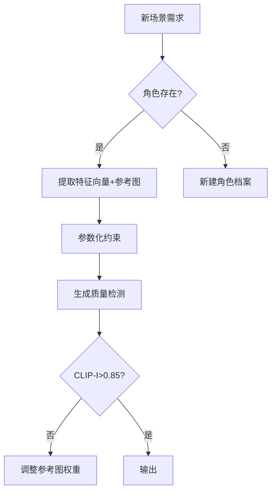

# Visualize_fiction

这是一个基于uv管理的小说可视化项目，目标是实现将小说生成视频的环节自动化，让创作者只用注意其中的几个关键点便可以完成视频的生成。

这个项目是受到来自B站的某些up，总是更新到一半就不更了！！！！（或者更的太慢？）

[【26小时精品漫画】得知我和青梅联姻后，一向高冷矜贵的京圈大小姐彻底急了！](https://www.bilibili.com/video/BV1CTQkYfELF?spm_id_from=333.788.videopod.episodes&vd_source=7c5af907927ab5070c4787c2f1712d49&p=5)

## 进度

### 2025.4.6

项目立项，探究工作流

## 工作流

### 0.01

**当前工作流假设小说人物肖像不会出现太大改动**  

1. 文本预处理
   1. 首先将小说按照章节分段，储存下来
   2. 大模型阅读小说，对于每一章进行分析，提取出重要的角色及其有关信息，按照一定方式储存，按照时间线总结分析主要次要人物，分析出哪些人物需要生成肖像以获得更好的观感，哪些人物的肖像可以直接临场生成
   3. 大模型根据对应信息，总结输出对应人物的肖像特征，并且整理成为图像生成模型的prompt
2. 肖像生成，建立​​角色特征数据库
   2. 调用图像生成大模型对于肖像进行生成，并且人工审核后生成对应的肖像库，包含人物不同表情的照片，使用IP Adapter来生成prompt，并且将prompt和对应的图片储存下来
   2. 将以上数据库作为基础，建立角色特征数据库，用于后续的角色一致性
3. 音频处理
   1. 直接按照对应图片切片，使用大模型进行文本转语音，生成对应的音频，音色使用最简单的方式
4. 视频合成
   1. 图片和音频按照时间线进行合成，生成对应的视频
   2. 图片直接使用最简单的动画，上下移动

## 模块解析

### 系统性角色管理策略

## 一些链接

### 理论工具

[【小白】一文读懂CLIP图文多模态模型](https://blog.csdn.net/weixin_47228643/article/details/136690837)

[Midjourney 实现角色一致性的新方法](https://juejin.cn/post/7312759727994028071)

[DALL-E 3 中神奇的格子布局 使用 4 格布局实现了高度的角色一致性](https://myaiforce.com.cn/dalle-3-grid-layout/)

[IP Adapter 实现人物一致性](https://zhuanlan.zhihu.com/p/655898828)

[Stable Diffusion【ControlNet】：ControlNet的IP-Adapter预处理器：SD垫图实现](https://zhuanlan.zhihu.com/p/673371624)

[【小白】一文读懂CLIP图文多模态模型](https://blog.csdn.net/weixin_47228643/article/details/136690837)

[小红书开源StoryMaker：让图像生成中的角色与背景完美融合，个性化与一致性兼得](https://zhuanlan.zhihu.com/p/11051569775)

[StoryMaker](https://github.com/RedAIGC/StoryMaker)

### 模型提供

[可灵](https://app.klingai.com/cn/)