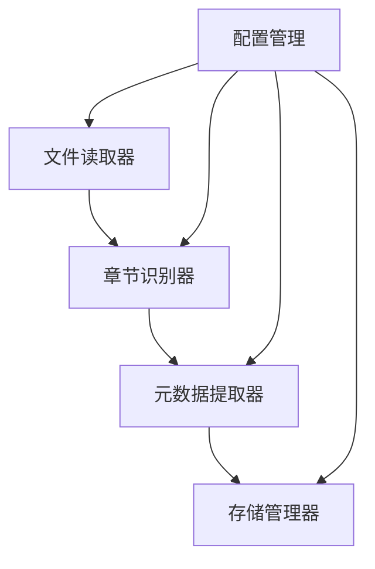

# 章节解析器模块开发文档

## 模块概述

章节解析器模块是文本预处理的核心组件，负责将原始小说文本解析为结构化的章节数据。该模块支持多种文件格式的读取，能够自动识别章节边界，提取章节元数据，并将结果以结构化格式存储。

## 架构设计

章节解析器采用模块化设计，分为以下几个主要组件：



## 主要组件

### 1. ChapterParser

**功能**：章节解析器的主类，整合各组件功能，提供对外接口。

**主要方法**：

- `__init__(config_path=None)`：初始化解析器，加载配置并初始化各组件。
  - 参数：
    - `config_path`：配置文件路径，如果为None则使用默认配置
  - 处理逻辑：
    - 加载配置文件
    - 初始化文件读取器、章节识别器、元数据提取器和存储管理器

- `parse_file(file_path, save=True, output_path=None)`：解析小说文件。
  - 参数：
    - `file_path`：小说文件路径
    - `save`：是否保存结果
    - `output_path`：可选的输出路径
  - 处理逻辑：
    - 读取文件内容
    - 检测章节边界
    - 提取章节元数据
    - 构建书籍信息
    - 保存结果（如果需要）
  - 返回值：包含解析结果和保存信息的字典

- `_extract_book_title(file_path, chapters)`：提取书籍标题。
  - 参数：
    - `file_path`：文件路径
    - `chapters`：章节列表
  - 处理逻辑：
    - 尝试从文件名提取
    - 如果文件名不合适，尝试从第一章标题提取
    - 如果无法提取，使用文件名
  - 返回值：书籍标题字符串

### 2. FileReader

**功能**：文件读取器，处理不同格式的文件读取。

**主要方法**：

- `__init__(config)`：初始化文件读取器。
  - 参数：
    - `config`：读取器配置
  - 处理逻辑：
    - 注册不同格式的处理器

- `read(file_path)`：读取文件内容。
  - 参数：
    - `file_path`：文件路径
  - 处理逻辑：
    - 根据文件扩展名选择合适的处理器
    - 调用对应的处理方法
  - 返回值：文件内容字符串

- `_read_txt(file_path)`：读取TXT文件。
  - 参数：
    - `file_path`：文件路径
  - 处理逻辑：
    - 尝试使用配置中指定的编码列表读取文件
    - 如果所有编码都失败，抛出异常
  - 返回值：文件内容字符串

### 3. ChapterDetector

**功能**：章节识别器，识别章节边界。

**主要方法**：

- `__init__(config)`：初始化章节识别器。
  - 参数：
    - `config`：识别器配置
  - 处理逻辑：
    - 加载章节识别的正则表达式模式
    - 设置最小章节长度
    - 配置非章节内容的关键词
    - 设置特殊章节类型的模式
    - 配置文本清理选项

- `detect_chapters(text)`：检测章节分隔。
  - 参数：
    - `text`：小说文本
  - 处理逻辑：
    - 使用正则表达式查找所有可能的章节标题
    - 按位置排序
    - 提取章节内容
    - 过滤非章节内容（如作者公告、说明等）
    - 检查特殊章节类型的位置是否合适
    - 检查章节长度是否符合要求
    - 清理文本（如果配置了）
  - 返回值：章节列表，每项为(标题, 内容)元组

- `_clean_text(text)`：清理文本中的异常标点和空格。
  - 参数：
    - `text`：需要清理的文本
  - 处理逻辑：
    - 去除行首行尾的空白字符
    - 替换连续的空格为单个空格
    - 替换中文标点前后的空格
    - 替换连续的标点符号
    - 规范化引号、括号和省略号
    - 删除行末无意义的标点符号
  - 返回值：清理后的文本

### 4. BasicMetadataExtractor

**功能**：元数据提取器，提取章节基本信息。

**主要方法**：

- `__init__(config)`：初始化元数据提取器。
  - 参数：
    - `config`：提取器配置
  - 处理逻辑：
    - 配置编号提取正则表达式
    - 配置章节类型识别模式

- `extract_metadata(title, content)`：提取基本元数据。
  - 参数：
    - `title`：章节标题
    - `content`：章节内容
  - 处理逻辑：
    - 提取章节编号
    - 识别章节类型
    - 计算字数
  - 返回值：包含标题、编号、类型和字数的元数据字典

- `_extract_number(title)`：从标题中提取章节编号。
  - 参数：
    - `title`：章节标题
  - 处理逻辑：
    - 使用正则表达式匹配章节编号
    - 处理中文数字和阿拉伯数字
  - 返回值：章节编号（整数），如果无法提取则为None

- `_chinese_to_int(chinese_num)`：将中文数字转换为整数。
  - 参数：
    - `chinese_num`：中文数字字符串
  - 处理逻辑：
    - 处理特殊情况
    - 处理"十"开头的特殊情况
    - 从左到右扫描，处理数字和单位
  - 返回值：转换后的整数

- `_identify_type(title)`：识别章节类型。
  - 参数：
    - `title`：章节标题
  - 处理逻辑：
    - 使用正则表达式匹配不同类型的章节标题
  - 返回值：章节类型字符串（prologue, epilogue, chapter）

### 5. YamlStorage

**功能**：YAML存储实现，负责数据持久化。

**主要方法**：

- `__init__(config)`：初始化YAML存储管理器。
  - 参数：
    - `config`：存储配置
  - 处理逻辑：
    - 设置输出目录
    - 配置是否分章节存储

- `save(result, path=None)`：保存解析结果到YAML文件。
  - 参数：
    - `result`：解析结果
    - `path`：可选的输出文件路径
  - 处理逻辑：
    - 确定输出路径
    - 确保输出目录存在
    - 添加处理时间和版本信息
    - 为每个章节添加唯一ID
    - 保存到YAML文件
  - 返回值：包含文件路径和存储模式的字典

## 数据结构

章节解析器将小说解析为以下结构化数据格式：

```yaml
# 书籍信息
book_info:
  title: "小说标题"
  total_chapters: 30
  total_words: 150000
  source_file: "原始文件路径.txt"
  processed_date: "2025-04-11T12:34:59"
  version: "0.1"

# 章节列表
chapters:
  - id: "ch001"  # 唯一标识符
    index: 0
    type: "prologue"  # 章节类型：prologue(序章), chapter(正文章节), epilogue(尾声)
    title: "序章"
    number: null  # 章节编号，序章可能没有编号
    word_count: 2500
    content: "序章的内容..."
    
  - id: "ch002"
    index: 1
    type: "chapter"
    title: "第一章 开始的旅程"
    number: 1
    word_count: 5000
    content: "第一章的内容..."
```

## 配置文件

章节解析器使用YAML格式的配置文件，位于`config/config.yaml`中：

```yaml
text_processing:
  chapter_parser:
    # 文件读取配置
    file_reader:
      encodings: 
        - utf-8
        - gbk
        - gb2312

    # 章节识别配置
    chapter_detector:
      # 章节标题匹配模式（正则表达式）
      patterns:
        - '第\s*[一二三四五六七八九十百千万\d]+\s*[章节回].*?\n'
        - '序\s*章.*?\n'
        - '尾\s*声.*?\n'
        - '后\s*记.*?\n'
      # 最小章节长度（字符数）
      min_chapter_length: 10
      # 是否清理文本
      clean_text: true
      # 非章节内容的关键词（用于过滤作者公告、说明等）
      non_chapter_keywords:
        - 更新
        - 加精
        - 推荐
        - 感谢
        - 支持
        - 召开
        - 投票
        - 冲榜
        - 书友
        - 谢谢

    # 存储配置
    storage:
      # 输出目录
      output_dir: data/processed/
      # 是否分章节存储
      split_chapters: false
```

## 使用示例

```python
from src.text_processing.chapter_parser import ChapterParser

# 初始化解析器（使用默认配置）
parser = ChapterParser()

# 解析小说文件
result = parser.parse_file('data/novels/my_novel.txt')

# 输出解析结果
print(f"解析完成，共{result['result']['book_info']['total_chapters']}章，"
      f"{result['result']['book_info']['total_words']}字")

# 查看保存路径
if 'file_path' in result['save_info']:
    print(f"文件已保存到: {result['save_info']['file_path']}")
```

## 命令行工具

项目提供了一个命令行工具用于解析小说文件：

```bash
python examples/parse_novel.py path/to/novel.txt [-o output_path] [-v]
```

参数说明：
- `path/to/novel.txt`：小说文件路径
- `-o, --output`：输出文件路径（可选）
- `-v, --verbose`：显示详细信息（可选）

## 注意事项

1. **编码处理**：默认支持UTF-8、GBK和GB2312编码，可以在配置文件中添加其他编码。

2. **章节识别**：
   - 默认使用正则表达式匹配章节标题
   - 可以在配置文件中添加自定义的匹配模式
   - 会过滤掉作者公告、更新说明等非章节内容
   - 会检查特殊章节类型的位置是否合适（如序章应在开头，尾声应在结尾）

3. **文本清理**：
   - 默认会清理文本中的异常标点和空格
   - 会删除行末无意义的标点符号（如逗号、分号、冒号、顿号等）
   - 可以在配置文件中关闭文本清理功能

4. **存储格式**：
   - 默认使用YAML格式存储解析结果
   - 可以配置是否分章节存储
   - 每个章节都有唯一ID，便于未来数据库迁移
