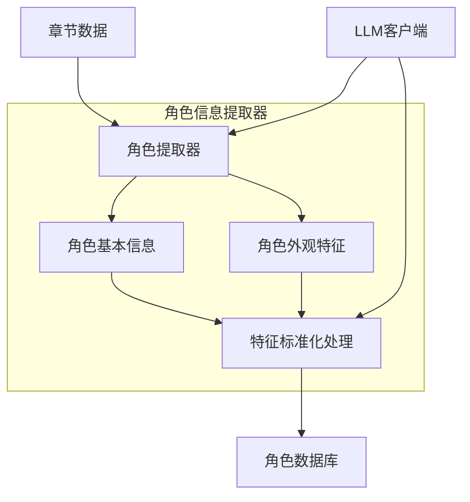
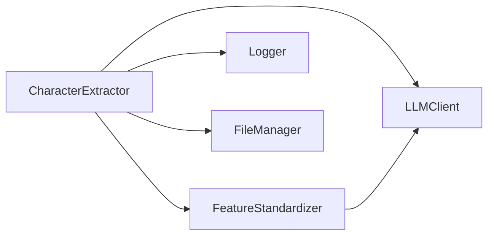
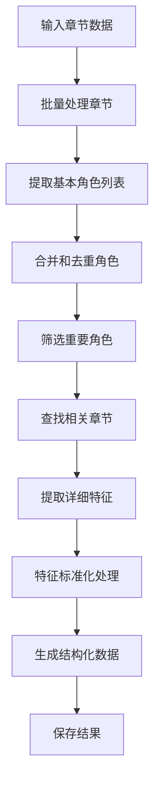
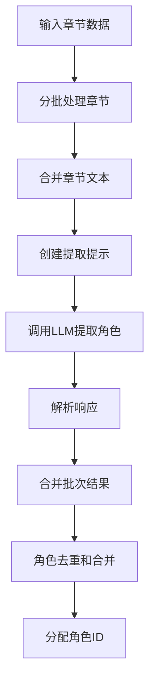
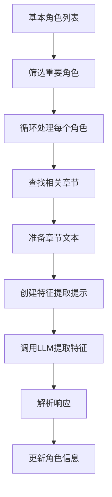
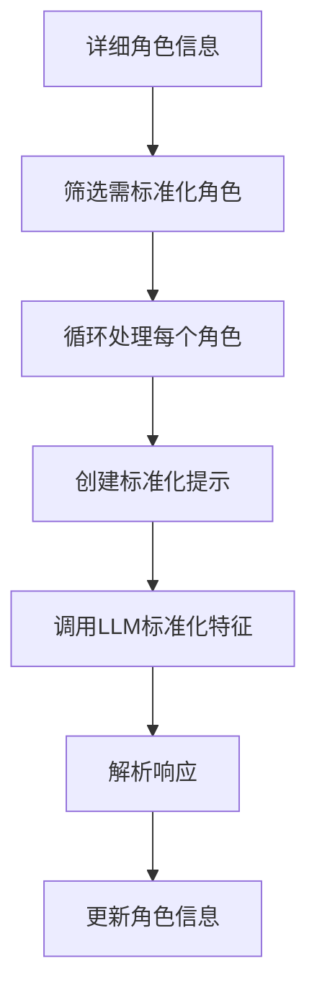

# 角色提取器模块开发文档

## 文档信息

| 文档属性 | 值 |
|---------|-----|
| 文档名称 | 角色提取器模块开发文档 |
| 版本号   | v0.01 |
| 创建日期 | 2025-04-11 |
| 最后更新 | 2025-04-11 |
| 状态     | 草稿 |
| 作者     | 项目团队 |

## 目录

1. [模块概述](#模块概述)
2. [架构设计](#架构设计)
3. [核心组件](#核心组件)
4. [工作流程](#工作流程)
5. [配置说明](#配置说明)
6. [使用示例](#使用示例)
7. [API文档](#API文档)
8. [数据结构](#数据结构)
9. [提示工程](#提示工程)
10. [测试说明](#测试说明)
11. [性能优化](#性能优化)
12. [常见问题](#常见问题)

## 模块概述

角色提取器模块是Visualize Fiction项目的核心组件之一，负责从小说文本中提取角色信息，包括基本属性、外观特征等。该模块利用大语言模型（LLM）的文本理解能力，通过精心设计的提示工程，实现高质量的角色信息提取和标准化。

### 主要功能

1. **角色识别**：从小说文本中识别主要和次要角色
2. **基本信息提取**：提取角色的基本属性（性别、年龄、职业等）
3. **外观特征提取**：提取角色的外貌特征描述
4. **特征标准化**：对所有角色的外观特征进行标准化和结构化处理
5. **结构化存储**：将角色信息以结构化方式存储

### 设计目标

1. **高质量提取**：通过精心设计的提示工程，确保提取信息的准确性和完整性
2. **可扩展性**：模块化设计，便于扩展新功能和支持新的LLM模型
3. **可配置性**：提供丰富的配置选项，适应不同的提取需求
4. **性能优化**：批量处理和并行处理机制，提高大型小说的处理效率
5. **容错能力**：内置错误处理和重试机制，提高系统稳定性

## 架构设计

角色提取器模块采用分层架构设计，各组件职责明确，便于扩展和维护。



### 模块依赖关系



## 核心组件

### 1. LLM客户端 (LLMClient)

LLM客户端负责与大语言模型API的交互，封装了请求构建、响应解析、错误处理等功能。

**主要特性**：
- 支持多种LLM模型（默认使用DeepSeek Chat）
- 灵活的API密钥配置（支持直接配置、文件加载、环境变量）
- 内置重试机制和错误处理
- JSON模式支持，确保响应格式一致
- 自动修复无效JSON响应

### 2. 角色提取器 (CharacterExtractor)

角色提取器是模块的核心类，负责从章节文本中提取角色信息。

**主要特性**：
- 批量处理章节，避免超出上下文限制
- 角色信息合并和去重
- 根据重要性筛选角色进行详细特征提取
- 相关章节查找算法，提高特征提取质量
- 结构化数据生成和存储

**核心方法**：
- `extract_from_chapters`: 从章节中提取角色信息的主入口
- `_extract_basic_characters`: 提取基本角色列表
- `_extract_detailed_features`: 提取角色详细特征
- `_find_relevant_chapters`: 查找与角色相关的章节
- `_merge_characters`: 合并和去重角色信息

### 3. 特征标准化器 (FeatureStandardizer)

特征标准化器负责对提取的角色外观特征进行标准化和结构化处理。

**主要特性**：
- 面部特征结构化（脸型、眼睛、鼻子、嘴巴等）
- 基于角色属性的特征推断和补充
- 标准化描述生成，便于后续肖像生成

## 工作流程

角色提取器的工作流程分为以下几个主要阶段：



### 1. 基本角色提取流程



### 2. 详细特征提取流程



### 3. 特征标准化流程



## 配置说明

角色提取器模块的配置位于`config/config.yaml`文件的`text_processing.character_extractor`部分。以下是主要配置项的详细说明：

### LLM配置

```yaml
llm:
  model: "deepseek-chat"  # 使用的LLM模型
  api_key: "${API_KEY}"   # API密钥（可使用环境变量）
  api_key_file: "API.config.yaml"  # API密钥文件路径
  max_tokens: 4000        # 最大生成token数
  temperature: 0.7        # 生成温度（0-1之间，越低越确定性）
  retry_count: 3          # 请求失败时的重试次数
  timeout: 30             # 请求超时时间（秒）
  json_mode: true         # 是否启用JSON模式
```

### 提取配置

```yaml
extraction:
  batch_size: 5           # 章节批处理大小（每批处理的章节数）
  max_relevant_chapters: 10  # 每个角色最大相关章节数
  importance_threshold:   # 重要性阈值
    main: 0.8             # 主角阈值（置信度）
    supporting: 0.5       # 配角阈值（置信度）
  content_truncation:     # 内容截断配置
    enabled: true         # 是否启用内容截断
    head_chars: 2000      # 保留开头字符数
    tail_chars: 1000      # 保留结尾字符数
```

### 特征标准化配置

```yaml
feature_standardization:
  enabled: true           # 是否启用特征标准化
  mode: "all"             # 标准化模式：all(所有角色), main(主角), missing(缺失描述)
  structured_features:    # 结构化特征配置
    face_elements:        # 面部元素列表
      - "face_shape"      # 脸型
      - "eyes"            # 眼睛
      - "nose"            # 鼻子
      - "mouth"           # 嘴巴
      - "eyebrows"        # 眉毛
      - "skin"            # 肤色和肤质
      - "distinctive_features"  # 其他显著特征
```

### 输出配置

```yaml
output_dir: "data/characters/"  # 输出目录
save_results: true        # 是否保存结果
output_format: "json"     # 输出格式（json/yaml）
```

### 提示模板配置

```yaml
prompts:
  character_extraction:   # 角色提取提示模板
    system: |
      你是一个专业的文学分析助手，擅长从小说文本中提取角色信息。
      你的任务是从提供的小说章节中识别所有角色，并按重要性分类。
      请严格按照指定的JSON格式返回结果，不要添加任何额外的解释或评论。
    user: |
      请从以下小说章节中识别所有角色，并提供他们的基本信息。
      
      小说章节:
      ```
      {chapters_text}
      ```
      
      请以JSON格式返回结果，必须包含以下字段:
      
      ```json
      {{
        "characters": [
          {{
            "name": "角色名称",
            "aliases": ["可能的别名1", "可能的别名2"],
            "importance": "主角/配角/次要角色",
            "first_appearance": "首次出现的章节标题或位置",
            "attributes": {{
              "gender": "性别",
              "age": "年龄描述",
              "occupation": "职业或身份"
            }}
          }}
        ]
      }}
      ```
      
      重要说明:
      1. 只识别有名字的角色，忽略匿名角色
      2. 主角是故事的核心人物，配角是对故事有重要影响的人物，次要角色是短暂出现或影响有限的人物
      3. 如果某些信息无法确定，使用null值
      4. 确保JSON格式正确，可以被直接解析
```

## 使用示例

### 基本使用

```python
from src.text_processing import ChapterParser, CharacterExtractor
from src.utils.config_loader import load_config

# 加载配置
config = load_config()

# 解析小说文件
chapter_parser = ChapterParser()
parse_result = chapter_parser.parse_file("小说.txt")
chapters = parse_result['result']['chapters']
book_info = parse_result['result']['book_info']

# 提取角色信息
character_extractor = CharacterExtractor(config['text_processing']['character_extractor'])
result = character_extractor.extract_from_chapters(chapters, book_info)

# 输出结果
for character in result['characters']:
    if character.get('importance') == '主角':
        print(f"主角: {character['name']}")
        if 'appearance' in character and 'face' in character['appearance']:
            print(f"外观: {character['appearance']['face']}")
```

### 自定义LLM客户端

```python
from src.text_processing import CharacterExtractor, LLMClient
from src.utils.config_loader import load_config

# 加载配置
config = load_config()

# 创建自定义LLM客户端
llm_config = {
    "model": "gpt-4",
    "api_key": "your-api-key",
    "temperature": 0.5,
    "max_tokens": 8000
}
llm_client = LLMClient(llm_config)

# 创建角色提取器并传入自定义LLM客户端
extractor_config = config['text_processing']['character_extractor']
character_extractor = CharacterExtractor(extractor_config, llm_client=llm_client)

# 提取角色信息
result = character_extractor.extract_from_chapters(chapters, book_info)
```

### 仅提取主要角色

```python
from src.text_processing import CharacterExtractor
from src.utils.config_loader import load_config
import copy

# 加载配置
config = load_config()
extractor_config = copy.deepcopy(config['text_processing']['character_extractor'])

# 修改配置，只提取主要角色
extractor_config['extraction']['importance_threshold'] = {
    'main': 0.8,
    'supporting': 0.8  # 提高配角阈值，只保留主角
}

# 创建角色提取器
character_extractor = CharacterExtractor(extractor_config)

# 提取角色信息
result = character_extractor.extract_from_chapters(chapters, book_info)

# 输出主角信息
main_characters = [c for c in result['characters'] if c.get('importance') == '主角']
print(f"提取到 {len(main_characters)} 个主角")
```

### 命令行使用

项目提供了命令行工具`examples/extract_characters.py`，可以直接从小说文件中提取角色信息：

```bash
python examples/extract_characters.py 小说.txt -o 输出.json -v
```

参数说明：
- `小说.txt`：小说文件路径
- `-o, --output`：输出文件路径
- `-c, --config`：配置文件路径
- `-v, --verbose`：显示详细日志
- `--no-save`：不保存提取结果
- `--no-standardize`：不进行特征标准化
- `--api-key`：API密钥
- `--api-key-file`：API密钥文件路径
- `--model`：LLM模型名称
- `--batch-size`：章节批处理大小
- `--max-chapters`：最大处理章节数

### 批量处理多本小说

```python
import os
from src.text_processing import ChapterParser, CharacterExtractor
from src.utils.config_loader import load_config

# 加载配置
config = load_config()
extractor_config = config['text_processing']['character_extractor']

# 创建解析器和提取器
chapter_parser = ChapterParser()
character_extractor = CharacterExtractor(extractor_config)

# 小说文件目录
novels_dir = "data/novels/"
output_dir = "data/characters/"

# 处理目录中的所有小说文件
for filename in os.listdir(novels_dir):
    if filename.endswith(".txt"):
        novel_path = os.path.join(novels_dir, filename)
        print(f"处理小说: {filename}")
        
        # 解析小说
        parse_result = chapter_parser.parse_file(novel_path)
        chapters = parse_result['result']['chapters']
        book_info = parse_result['result']['book_info']
        
        # 提取角色信息
        result = character_extractor.extract_from_chapters(chapters, book_info)
        
        # 输出结果
        output_filename = f"{os.path.splitext(filename)[0]}_characters.json"
        output_path = os.path.join(output_dir, output_filename)
        
        with open(output_path, 'w', encoding='utf-8') as f:
            import json
            json.dump(result, f, ensure_ascii=False, indent=2)
            
        print(f"角色信息已保存到: {output_path}")
```

## API文档

### CharacterExtractor

```python
class CharacterExtractor:
    """角色信息提取器，从小说文本中提取角色信息"""
    
    def __init__(self, config: Dict[str, Any], llm_client=None):
        """
        初始化角色提取器
        
        Args:
            config: 配置对象，包含LLM配置、提取配置等
            llm_client: 大语言模型客户端，如果为None则创建新实例
        """
        
    def extract_from_chapters(self, chapters: List[Dict[str, Any]], book_info: Dict[str, Any] = None) -> Dict[str, Any]:
        """
        从章节中提取角色信息
        
        Args:
            chapters: 章节数据列表，每个章节包含title和content
            book_info: 书籍信息，可选，包含title等元数据
            
        Returns:
            Dict[str, Any]: 角色信息数据库，包含characters和metadata
        """
        
    def _extract_basic_characters(self, chapters: List[Dict[str, Any]]) -> List[Dict[str, Any]]:
        """
        提取基本角色列表
        
        Args:
            chapters: 章节数据列表
            
        Returns:
            List[Dict[str, Any]]: 基本角色列表
        """
        
    def _prepare_chapters_text(self, chapters: List[Dict[str, Any]]) -> str:
        """
        准备用于提取的章节文本
        
        Args:
            chapters: 章节数据列表
            
        Returns:
            str: 合并的章节文本
        """
        
    def _create_character_extraction_prompt(self, chapters_text: str) -> Dict[str, str]:
        """
        创建角色提取提示
        
        Args:
            chapters_text: 章节文本
            
        Returns:
            Dict[str, str]: 提示词，包含system和user部分
        """
        
    def _parse_character_response(self, response: str) -> List[Dict[str, Any]]:
        """
        解析角色提取响应
        
        Args:
            response: LLM响应
            
        Returns:
            List[Dict[str, Any]]: 角色列表
        """
        
    def _merge_characters(self, characters: List[Dict[str, Any]]) -> List[Dict[str, Any]]:
        """
        合并和去重角色
        
        Args:
            characters: 角色列表
            
        Returns:
            List[Dict[str, Any]]: 合并后的角色列表
        """
        
    def _extract_detailed_features(self, basic_characters: List[Dict[str, Any]], chapters: List[Dict[str, Any]]) -> List[Dict[str, Any]]:
        """
        提取角色详细特征
        
        Args:
            basic_characters: 基本角色列表
            chapters: 章节数据列表
            
        Returns:
            List[Dict[str, Any]]: 带详细特征的角色列表
        """
        
    def _find_relevant_chapters(self, character: Dict[str, Any], chapters: List[Dict[str, Any]]) -> List[Dict[str, Any]]:
        """
        查找与角色相关的章节
        
        Args:
            character: 角色信息
            chapters: 所有章节数据
            
        Returns:
            List[Dict[str, Any]]: 相关章节列表
        """
        
    def _create_feature_extraction_prompt(self, character_name: str, chapters_text: str) -> Dict[str, str]:
        """
        创建特征提取提示
        
        Args:
            character_name: 角色名称
            chapters_text: 章节文本
            
        Returns:
            Dict[str, str]: 提示词，包含system和user部分
        """
        
    def _parse_feature_response(self, response: str) -> Dict[str, Any]:
        """
        解析特征提取响应
        
        Args:
            response: LLM响应
            
        Returns:
            Dict[str, Any]: 特征信息
        """
        
    def _create_metadata(self, characters: List[Dict[str, Any]], book_info: Optional[Dict[str, Any]] = None) -> Dict[str, Any]:
        """
        创建元数据
        
        Args:
            characters: 角色列表
            book_info: 书籍信息，可选
            
        Returns:
            Dict[str, Any]: 元数据
        """
        
    def _get_current_date(self) -> str:
        """
        获取当前日期
        
        Returns:
            str: 当前日期，格式为YYYY-MM-DD
        """
        
    def _save_results(self, results: Dict[str, Any], book_info: Optional[Dict[str, Any]] = None) -> str:
        """
        保存提取结果
        
        Args:
            results: 提取结果
            book_info: 书籍信息，可选
            
        Returns:
            str: 保存的文件路径
        """
```

### LLMClient

```python
class LLMClient:
    """大语言模型客户端，封装API调用"""
    
    def __init__(self, config: Dict[str, Any]):
        """
        初始化客户端
        
        Args:
            config: 配置对象，包含API密钥、模型名称等
        """
        
    def query(self, prompt: Dict[str, str], json_mode: bool = True) -> str:
        """
        发送查询到LLM
        
        Args:
            prompt: 提示词，包含system和user部分
            json_mode: 是否启用JSON模式
            
        Returns:
            str: 模型响应
        """
        
    def _load_api_key(self, config: Dict[str, Any]) -> str:
        """
        加载API密钥
        
        Args:
            config: 配置对象
            
        Returns:
            str: API密钥
        """
        
    def _build_request(self, prompt: Dict[str, str], json_mode: bool) -> Dict[str, Any]:
        """
        构建请求
        
        Args:
            prompt: 提示词
            json_mode: 是否启用JSON模式
            
        Returns:
            Dict[str, Any]: 请求数据
        """
        
    def _send_request(self, request_data: Dict[str, Any]) -> Dict[str, Any]:
        """
        发送请求
        
        Args:
            request_data: 请求数据
            
        Returns:
            Dict[str, Any]: 响应数据
        """
        
    def _parse_response(self, response: Dict[str, Any]) -> str:
        """
        解析响应
        
        Args:
            response: 响应数据
            
        Returns:
            str: 模型生成的文本
        """
        
    def _fix_json(self, json_str: str) -> str:
        """
        修复无效的JSON字符串
        
        Args:
            json_str: JSON字符串
            
        Returns:
            str: 修复后的JSON字符串
        """
```

### FeatureStandardizer

```python
class FeatureStandardizer:
    """特征标准化器，对角色外观特征进行标准化和结构化处理"""
    
    def __init__(self, config: Dict[str, Any], llm_client=None):
        """
        初始化特征标准化器
        
        Args:
            config: 配置对象
            llm_client: 大语言模型客户端，如果为None则创建新实例
        """
        
    def standardize_features(self, character: Dict[str, Any]) -> Dict[str, Any]:
        """
        标准化角色特征
        
        Args:
            character: 角色信息
            
        Returns:
            Dict[str, Any]: 标准化后的角色信息
        """
        
    def _create_standardization_prompt(self, character: Dict[str, Any]) -> Dict[str, str]:
        """
        创建标准化提示
        
        Args:
            character: 角色信息
            
        Returns:
            Dict[str, str]: 提示词，包含system和user部分
        """
        
    def _parse_standardization_response(self, response: str) -> Dict[str, Any]:
        """
        解析标准化响应
        
        Args:
            response: LLM响应
            
        Returns:
            Dict[str, Any]: 标准化特征
        """
```

## 数据结构

### 输入数据

角色提取器的输入是章节解析器生成的章节数据，每个章节包含标题和内容：

```json
[
  {
    "title": "第一章 开始",
    "content": "章节内容...",
    "index": 0,
    "number": 1,
    "type": "chapter",
    "word_count": 1000
  },
  {
    "title": "第二章 发展",
    "content": "章节内容...",
    "index": 1,
    "number": 2,
    "type": "chapter",
    "word_count": 1200
  }
]
```

### 输出数据

角色提取器的输出是结构化的角色信息数据库：

```json
{
  "characters": [
    {
      "id": "char001",
      "name": "角色名称",
      "aliases": ["别名1", "别名2"],
      "importance": "主角/配角/次要角色",
      "first_appearance": "章节标题",
      "attributes": {
        "gender": "性别",
        "age": "年龄",
        "occupation": "职业"
      },
      "appearance": {
        "face": "面部特征描述",
        "body": "体型特征描述",
        "clothing": "服饰特征描述",
        "structured_features": {
          "face_shape": "脸型描述",
          "eyes": "眼睛描述",
          "nose": "鼻子描述",
          "mouth": "嘴巴描述",
          "eyebrows": "眉毛描述",
          "skin": "肤色和肤质描述",
          "distinctive_features": "其他显著特征"
        },
        "text_references": [
          {
            "description": "原文中的描述片段",
            "context": "描述出现的上下文"
          }
        ],
        "features_standardized": true
      }
    }
  ],
  "metadata": {
    "book_title": "小说标题",
    "total_characters": 10,
    "main_characters": 2,
    "extraction_date": "2025-04-11",
    "version": "0.01"
  }
}
```

### 内部数据流

1. **基本角色提取**：
   - 输入：章节数据列表
   - 处理：分批处理章节，提取角色基本信息
   - 输出：基本角色列表，包含名称、别名、重要性等

2. **详细特征提取**：
   - 输入：基本角色列表、章节数据列表
   - 处理：查找相关章节，提取角色外观特征
   - 输出：带详细特征的角色列表

3. **特征标准化**：
   - 输入：带详细特征的角色列表
   - 处理：标准化和结构化外观特征
   - 输出：带标准化特征的角色列表

## 提示工程

角色提取器模块使用精心设计的提示工程来引导LLM生成高质量的结构化数据。以下是主要提示的设计思路和关键点：

### 1. 角色提取提示

角色提取提示旨在从章节文本中识别所有角色，并提取其基本信息。

**设计思路**：
- 明确任务定义，指导LLM专注于角色识别和基本信息提取
- 提供结构化的输出格式，确保返回的数据可直接解析
- 设置明确的角色重要性分类标准，便于后续处理
- 要求提取别名信息，解决角色多名称问题
- 记录首次出现位置，便于追踪角色引入时机

**关键优化点**：
- 使用JSON模式，确保输出格式一致
- 明确指示只识别有名字的角色，避免提取无关角色
- 提供明确的属性字段，确保信息完整性
- 允许使用null值处理未知信息，避免生成虚假信息

### 2. 特征提取提示

特征提取提示旨在从相关章节中提取特定角色的外观特征。

**设计思路**：
- 聚焦单个角色，提高提取质量
- 分类提取面部、体型和服饰特征
- 保留原文引用，便于验证和追溯
- 结构化存储特征描述，便于后续处理

**关键优化点**：
- 使用相关章节作为输入，提高提取效率
- 要求保留原文表述，避免过度概括
- 记录描述出现的上下文，便于理解描述的场景
- 分类存储不同类型的特征，便于后续肖像生成

### 3. 特征标准化提示

特征标准化提示旨在对提取的外观特征进行标准化和结构化处理。

**设计思路**：
- 基于已提取的特征，进行结构化处理
- 根据角色属性（性别、年龄等）推断缺失特征
- 生成统一格式的特征描述，便于后续处理
- 保留原始特征信息，避免信息丢失

**关键优化点**：
- 提供详细的面部元素分类，确保描述全面
- 要求保持与原始描述的一致性，避免矛盾
- 允许合理推断，但要标记推断内容
- 生成适合图像生成的描述格式

## 测试说明

角色提取器模块的测试位于`tests/test_character_extractor.py`文件中，包含单元测试和集成测试。

### 单元测试

单元测试主要测试各个组件的独立功能：

1. **初始化测试**：
   - 测试提取器是否正确初始化
   - 测试配置参数是否正确加载
   - 测试LLM客户端是否正确创建或使用

2. **章节文本准备测试**：
   - 测试章节文本合并功能
   - 测试长章节截断功能
   - 测试格式化输出功能

3. **提示创建测试**：
   - 测试角色提取提示创建
   - 测试特征提取提示创建
   - 测试模板替换功能

4. **响应解析测试**：
   - 测试JSON响应解析
   - 测试错误处理和恢复
   - 测试数据验证功能

5. **角色合并测试**：
   - 测试角色去重功能
   - 测试别名合并功能
   - 测试属性合并功能

6. **相关章节查找测试**：
   - 测试角色相关章节查找算法
   - 测试章节相关性排序
   - 测试最大章节数限制

### 集成测试

集成测试主要测试完整的提取流程：

1. **基本提取测试**：
   - 使用测试小说数据测试基本角色提取
   - 验证提取结果的完整性和准确性
   - 测试不同批处理大小的影响

2. **详细特征提取测试**：
   - 测试详细特征提取功能
   - 验证特征描述的完整性
   - 测试原文引用的准确性

3. **特征标准化测试**：
   - 测试特征标准化功能
   - 验证结构化特征的一致性
   - 测试不同标准化模式的效果

4. **端到端测试**：
   - 测试完整的提取流程
   - 验证输出数据的格式和内容
   - 测试结果保存功能

### 测试数据

测试使用以下数据：

1. **模拟章节数据**：
   - 包含预定义的角色和特征描述
   - 覆盖各种角色类型和特征描述场景
   - 设计边界情况和异常情况

2. **真实小说片段**：
   - 使用真实小说的节选作为测试数据
   - 包含不同类型和风格的小说
   - 覆盖不同语言和文化背景

### 运行测试

```bash
# 运行所有测试
python -m pytest tests/test_character_extractor.py -v

# 运行特定测试
python -m pytest tests/test_character_extractor.py::TestCharacterExtractor::test_extract_from_chapters -v

# 运行带覆盖率报告的测试
python -m pytest tests/test_character_extractor.py --cov=src.text_processing.character_extractor
```

## 性能优化

角色提取器模块针对大型小说和大量角色的场景进行了性能优化。

### 批量处理

为避免超出LLM上下文限制和提高处理效率，模块实现了批量处理机制：

1. **章节批处理**：
   - 将章节分批处理，每批包含可配置数量的章节
   - 默认批大小为5章，可通过配置调整
   - 每批处理后合并结果，确保信息完整性

2. **角色批处理**：
   - 对重要角色进行详细特征提取时分批处理
   - 显示进度信息，便于监控长时间运行
   - 支持中断恢复，避免全部重新处理

### 内容截断

为减少处理的文本量，模块实现了内容截断机制：

1. **章节内容截断**：
   - 对长章节进行智能截断，保留开头和结尾部分
   - 默认保留开头2000字符和结尾1000字符
   - 可通过配置调整截断参数或禁用截断

2. **相关章节筛选**：
   - 只处理与角色相关的章节，减少不必要的处理
   - 限制每个角色的最大相关章节数
   - 根据相关性排序章节，确保处理最相关的内容

### 缓存机制

为避免重复处理，模块实现了缓存机制：

1. **LLM响应缓存**：
   - 缓存LLM响应，避免相同提示重复请求
   - 支持持久化缓存，跨会话使用
   - 可配置缓存大小和过期时间

2. **中间结果缓存**：
   - 保存提取的基本角色信息，便于重新处理
   - 支持增量处理，只处理新添加的章节
   - 可配置缓存策略和存储位置

### 并行处理

为提高处理速度，模块支持并行处理：

1. **多线程处理**：
   - 支持多线程并行处理不同批次的章节
   - 可配置线程数，根据系统资源调整
   - 实现线程安全的结果合并

2. **异步处理**：
   - 支持异步API请求，提高LLM调用效率
   - 实现请求队列和响应处理机制
   - 支持请求限流，避免超出API限制

### 性能监控

模块提供性能监控功能，便于优化和调试：

1. **处理时间统计**：
   - 记录各阶段处理时间，识别瓶颈
   - 提供详细的性能日志，便于分析
   - 支持性能报告生成

2. **资源使用监控**：
   - 监控内存使用情况，避免内存溢出
   - 跟踪API调用次数和费用
   - 提供资源使用报告

## 常见问题

### 1. API密钥配置问题

**问题**：无法连接到LLM API，出现认证错误

**解决方案**：
- 检查API密钥是否正确配置
- 确认API密钥文件路径是否正确
- 尝试使用环境变量设置API密钥：`export API_KEY=your_key`
- 检查API密钥是否有效，可通过API提供商的测试工具验证

### 2. 内存占用过高问题

**问题**：处理大型小说时内存占用过高，甚至导致程序崩溃

**解决方案**：
- 减小批处理大小：`extraction.batch_size: 3`
- 启用内容截断：`extraction.content_truncation.enabled: true`
- 减小最大相关章节数：`extraction.max_relevant_chapters: 5`
- 增加处理间隔，允许垃圾回收：`extraction.processing_interval: 1`

### 3. 角色提取质量问题

**问题**：提取的角色信息不完整或不准确，缺少重要角色或包含不存在的角色

**解决方案**：
- 调整提示模板，增加更详细的指导
- 降低LLM温度参数：`llm.temperature: 0.3`
- 增加批处理大小，提供更多上下文：`extraction.batch_size: 8`
- 使用更高级的LLM模型：`llm.model: "gpt-4"`
- 检查章节文本是否正确解析，特别是特殊格式的小说

### 4. 特征提取不完整问题

**问题**：角色外观特征提取不完整，缺少重要描述或描述不准确

**解决方案**：
- 增加最大相关章节数：`extraction.max_relevant_chapters: 15`
- 调整特征提取提示，强调全面性
- 改进相关章节查找算法，考虑使用更复杂的相关性计算
- 对重要角色手动指定关键章节
- 检查原文中是否确实包含足够的描述

### 5. 特征标准化问题

**问题**：标准化后的特征描述不符合预期，包含矛盾或不合理的描述

**解决方案**：
- 检查特征标准化提示模板
- 确保原始特征提取质量
- 调整标准化模式：`feature_standardization.mode: "missing"`
- 降低LLM温度参数：`llm.temperature: 0.2`
- 对重要角色进行手动审核和修正

### 6. JSON解析错误

**问题**：LLM返回的JSON格式不正确，导致解析错误

**解决方案**：
- 确保启用JSON模式：`llm.json_mode: true`
- 增强提示中对JSON格式的强调
- 使用更适合结构化输出的LLM模型
- 实现更强大的JSON修复功能
- 对复杂结构分步请求，避免生成过于复杂的JSON

### 7. 处理速度问题

**问题**：处理大型小说耗时过长，影响使用体验

**解决方案**：
- 启用并行处理：`extraction.parallel_processing: true`
- 增加线程数：`extraction.thread_count: 4`
- 启用LLM响应缓存：`llm.cache.enabled: true`
- 使用响应更快的LLM模型
- 对非重要角色使用简化处理流程
