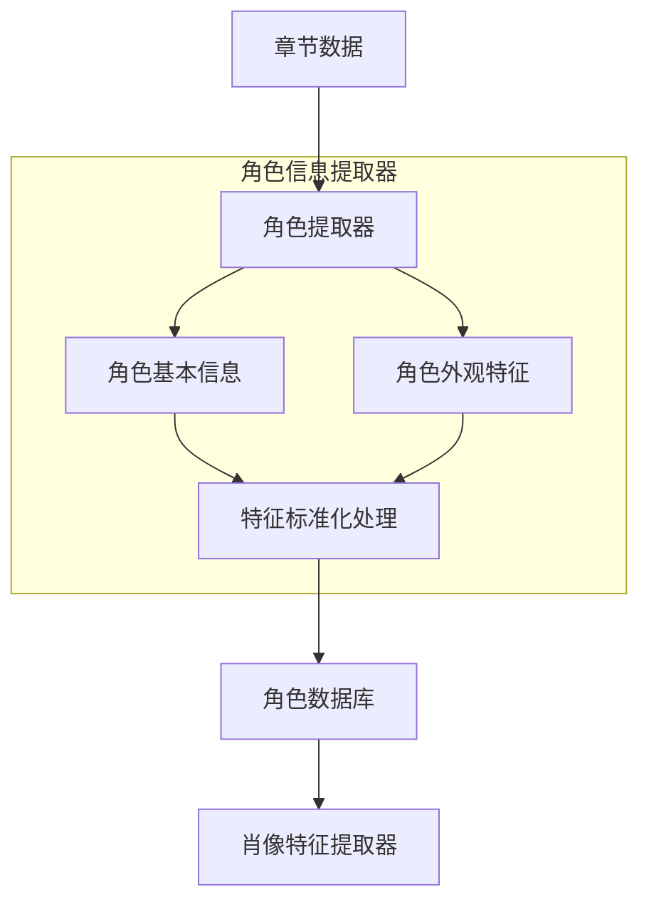

# 角色信息提取器开发规划

## 一、功能概述

角色信息提取器将专注于以下核心功能：

1. **角色识别**：识别小说中的主要和次要角色
2. **基本信息提取**：提取角色的基本属性（性别、年龄、职业等）
3. **外观特征提取**：提取角色的外貌特征描述
4. **特征标准化**：对所有角色的外观特征进行标准化和结构化处理
5. **结构化存储**：将角色信息以结构化方式存储

## 二、技术方案

### 1. 架构设计



### 2. 核心组件

1. **LLM客户端**：封装大模型API调用，处理请求和响应
2. **角色提取器**：使用提示工程从文本中提取角色信息
3. **特征标准化器**：对角色外观特征进行标准化和结构化处理
4. **数据存储管理器**：管理角色信息的结构化存储

### 3. 数据结构设计

角色信息数据库将采用以下结构：

```json
{
  "characters": [
    {
      "id": "char001",
      "name": "角色名称",
      "aliases": ["别名1", "别名2"],
      "importance": "主角/配角/次要角色",
      "first_appearance": "章节ID",
      "attributes": {
        "gender": "性别",
        "age": "年龄",
        "occupation": "职业",
        "background": "背景故事"
      },
      "appearance": {
        "face_original": "原始文本中的面部描述",
        "face": "标准化后的完整面部描述",
        "structured_features": {
          "face_shape": "脸型描述",
          "eyes": "眼睛描述",
          "nose": "鼻子描述",
          "mouth": "嘴巴描述",
          "eyebrows": "眉毛描述",
          "skin": "肤色和肤质描述",
          "distinctive_features": "其他显著特征"
        },
        "body": "体型特征描述",
        "clothing": "服饰特征描述",
        "features_standardized": true,
        "ai_enhanced": true,
        "user_edited": false
      },
      "mentions": [
        {
          "chapter_id": "章节ID",
          "count": "出现次数"
        }
      ]
    }
  ],
  "metadata": {
    "book_title": "小说标题",
    "total_characters": "角色总数",
    "main_characters": "主要角色数",
    "extraction_date": "提取日期",
    "version": "版本号"
  }
}
```

## 三、优化的提示工程设计

基于OpenAI的Structured Outputs功能，我们将优化提示工程设计，确保模型生成符合我们预期的JSON结构。

### 1. 角色识别提示（优化版）

```python
def create_character_extraction_prompt(chapters_text):
    system_prompt = """
    你是一个专业的文学分析助手，擅长从小说文本中提取角色信息。
    你的任务是从提供的小说章节中识别所有角色，并按重要性分类。
    请严格按照指定的JSON格式返回结果，不要添加任何额外的解释或评论。
    """
    
    user_prompt = f"""
    请从以下小说章节中识别所有角色，并提供他们的基本信息。
    
    小说章节:
    ```
    {chapters_text}
    ```
    
    请以JSON格式返回结果，必须包含以下字段:
    
    ```json
    {{
      "characters": [
        {{
          "name": "角色名称",
          "aliases": ["可能的别名1", "可能的别名2"],
          "importance": "主角/配角/次要角色",
          "first_appearance": "首次出现的章节标题或位置",
          "attributes": {{
            "gender": "性别",
            "age": "年龄描述",
            "occupation": "职业或身份"
          }}
        }}
      ]
    }}
    ```
    
    重要说明:
    1. 只识别有名字的角色，忽略匿名角色
    2. 主角是故事的核心人物，配角是对故事有重要影响的人物，次要角色是短暂出现或影响有限的人物
    3. 如果某些信息无法确定，使用null值
    4. 确保JSON格式正确，可以被直接解析
    """
    
    return {"system": system_prompt, "user": user_prompt}
```

### 2. 特征提取提示（优化版）

```python
def create_feature_extraction_prompt(character_name, chapters_text):
    system_prompt = """
    你是一个专业的文学分析助手，擅长从小说文本中提取角色的外观特征描述。
    你的任务是从提供的小说章节中提取指定角色的外观特征。
    请严格按照指定的JSON格式返回结果，不要添加任何额外的解释或评论。
    """
    
    user_prompt = f"""
    请从以下小说章节中提取角色"{character_name}"的外观特征描述。
    
    小说章节:
    ```
    {chapters_text}
    ```
    
    请以JSON格式返回结果，必须包含以下字段:
    
    ```json
    {{
      "appearance": {{
        "face": "面部特征描述，包括原文中提及的所有细节",
        "body": "体型特征描述，包括身高、体格、姿态等",
        "clothing": "服饰特征描述，包括常见着装、特殊装饰等",
        "text_references": [
          {{
            "description": "原文中的描述片段",
            "context": "描述出现的上下文"
          }}
        ]
      }}
    }}
    ```
    
    重要说明:
    1. 尽可能提取原文中的所有描述，保持原文表述
    2. text_references字段应包含原文中的直接引用，以便验证
    3. 如果某些信息在文本中未提及，使用null值
    4. 确保JSON格式正确，可以被直接解析
    """
    
    return {"system": system_prompt, "user": user_prompt}
```

### 3. 特征标准化提示（优化版）

```python
def create_feature_standardization_prompt(character_info):
    system_prompt = """
    你是一个专业的文学角色设计师，擅长标准化角色的外观特征描述。
    你的任务是基于提供的角色信息，生成标准化的面部特征描述。
    请严格按照指定的JSON格式返回结果，不要添加任何额外的解释或评论。
    """
    
    user_prompt = f"""
    请基于以下角色信息，生成标准化的面部特征描述:
    
    角色名称: {character_info['name']}
    性别: {character_info.get('attributes', {}).get('gender', '未知')}
    年龄: {character_info.get('attributes', {}).get('age', '未知')}
    职业: {character_info.get('attributes', {}).get('occupation', '未知')}
    原有描述: {character_info.get('appearance', {}).get('face', '')}
    
    请以JSON格式返回结果，必须包含以下字段:
    
    ```json
    {{
      "standardized_appearance": {{
        "face": "完整的面部描述段落，整合原有描述和补充内容",
        "structured_features": {{
          "face_shape": "脸型描述（圆形、方形、椭圆形等）",
          "eyes": "眼睛描述（形状、大小、颜色、特点）",
          "nose": "鼻子描述（形状、大小、特点）",
          "mouth": "嘴巴描述（形状、特点）",
          "eyebrows": "眉毛描述（形状、颜色、特点）",
          "skin": "肤色和肤质描述",
          "distinctive_features": "其他显著特征（如疤痕、胎记、雀斑等）"
        }}
      }}
    }}
    ```
    
    重要说明:
    1. 如果原有描述中已有某些特征信息，请保留并整合到标准化描述中
    2. 对于原有描述中没有的特征，请根据角色的性别、年龄、职业等信息合理推断
    3. 确保描述足够详细，以便用于肖像生成
    4. 确保JSON格式正确，可以被直接解析
    """
    
    return {"system": system_prompt, "user": user_prompt}
```

## 四、LLM客户端实现

```python
import json
import time
import requests
from typing import Dict, Any, Optional

class LLMClient:
    """大语言模型客户端，封装API调用"""
    
    def __init__(self, config: Dict[str, Any]):
        """初始化客户端
        
        Args:
            config: 配置对象
        """
        self.config = config
        self.api_key = self._load_api_key()
        self.model = config.get('model', 'gpt-4')
        self.max_tokens = config.get('max_tokens', 4000)
        self.temperature = config.get('temperature', 0.7)
        self.retry_count = config.get('retry_count', 3)
        self.timeout = config.get('timeout', 30)
        self.logger = self._get_logger()
        
    def _load_api_key(self) -> str:
        """加载API密钥
        
        Returns:
            str: API密钥
        """
        api_key_file = self.config.get('api_key_file')
        if api_key_file:
            try:
                with open(api_key_file, 'r') as f:
                    config = json.load(f) if api_key_file.endswith('.json') else yaml.safe_load(f)
                    return config.get('api_key')
            except Exception as e:
                raise ValueError(f"无法从文件加载API密钥: {e}")
        
        return self.config.get('api_key')
    
    def _get_logger(self):
        """获取日志记录器
        
        Returns:
            Logger: 日志记录器
        """
        from ..utils.logger import get_logger
        return get_logger(__name__)
    
    def query(self, prompt: Dict[str, str], json_mode: bool = True) -> str:
        """发送查询到LLM
        
        Args:
            prompt: 提示词，包含system和user部分
            json_mode: 是否启用JSON模式
            
        Returns:
            str: 模型响应
        """
        # 构建消息
        messages = [
            {"role": "system", "content": prompt["system"]},
            {"role": "user", "content": prompt["user"]}
        ]
        
        # 构建请求参数
        params = {
            "model": self.model,
            "messages": messages,
            "max_tokens": self.max_tokens,
            "temperature": self.temperature
        }
        
        # 如果启用JSON模式，添加response_format参数
        if json_mode:
            params["response_format"] = {"type": "json_object"}
        
        # 重试机制
        for attempt in range(self.retry_count):
            try:
                # 发送请求
                response = self._send_request(params)
                
                # 解析响应
                content = self._parse_response(response)
                
                # 如果启用JSON模式，验证JSON格式
                if json_mode:
                    try:
                        json.loads(content)
                    except json.JSONDecodeError:
                        self.logger.warning(f"响应不是有效的JSON格式，尝试修复")
                        content = self._fix_json(content)
                
                return content
                
            except Exception as e:
                self.logger.error(f"查询失败 (尝试 {attempt+1}/{self.retry_count}): {e}")
                if attempt < self.retry_count - 1:
                    time.sleep(2 ** attempt)  # 指数退避
                else:
                    raise
    
    def _send_request(self, params: Dict[str, Any]) -> Dict[str, Any]:
        """发送请求到API
        
        Args:
            params: 请求参数
            
        Returns:
            Dict[str, Any]: API响应
        """
        # 这里实现具体的API调用，根据使用的模型API进行适配
        # 以下是OpenAI API的示例实现
        headers = {
            "Authorization": f"Bearer {self.api_key}",
            "Content-Type": "application/json"
        }
        
        response = requests.post(
            "https://api.openai.com/v1/chat/completions",
            headers=headers,
            json=params,
            timeout=self.timeout
        )
        
        if response.status_code != 200:
            raise Exception(f"API请求失败: {response.status_code} {response.text}")
        
        return response.json()
    
    def _parse_response(self, response: Dict[str, Any]) -> str:
        """解析API响应
        
        Args:
            response: API响应
            
        Returns:
            str: 模型生成的内容
        """
        # 这里根据具体的API响应格式进行解析
        # 以下是OpenAI API的示例实现
        try:
            return response["choices"][0]["message"]["content"]
        except (KeyError, IndexError) as e:
            raise Exception(f"无法解析API响应: {e}")
    
    def _fix_json(self, text: str) -> str:
        """尝试修复无效的JSON
        
        Args:
            text: 可能包含JSON的文本
            
        Returns:
            str: 修复后的JSON文本
        """
        # 尝试提取JSON部分
        import re
        json_match = re.search(r'```json\s*([\s\S]*?)\s*```', text)
        if json_match:
            return json_match.group(1).strip()
        
        # 尝试找到JSON的开始和结束
        start_idx = text.find('{')
        end_idx = text.rfind('}')
        
        if start_idx != -1 and end_idx != -1 and end_idx > start_idx:
            return text[start_idx:end_idx+1]
        
        # 如果无法修复，返回原文本
        return text
```

## 五、角色提取器实现

```python
import json
from typing import Dict, List, Any, Optional
from ..utils.logger import get_logger

class CharacterExtractor:
    """角色信息提取器"""
    
    def __init__(self, config: Dict[str, Any], llm_client=None):
        """初始化角色提取器
        
        Args:
            config: 配置对象
            llm_client: 大语言模型客户端，如果为None则创建新实例
        """
        self.config = config
        self.llm_config = config.get('llm', {})
        
        # 如果未提供LLM客户端，创建一个新实例
        if llm_client is None:
            from .llm_client import LLMClient
            self.llm_client = LLMClient(self.llm_config)
        else:
            self.llm_client = llm_client
            
        self.logger = get_logger(__name__)
        
        # 加载提示模板
        self.prompts = config.get('prompts', {})
        
        # 初始化特征标准化器
        from .feature_standardizer import FeatureStandardizer
        self.feature_standardizer = FeatureStandardizer(config, self.llm_client)
    
    def extract_from_chapters(self, chapters: List[Dict[str, Any]]) -> Dict[str, Any]:
        """从章节中提取角色信息
        
        Args:
            chapters: 章节数据列表
            
        Returns:
            Dict[str, Any]: 角色信息数据库
        """
        self.logger.info(f"开始从 {len(chapters)} 个章节中提取角色信息")
        
        # 1. 提取基本角色列表
        basic_characters = self._extract_basic_characters(chapters)
        self.logger.info(f"提取到 {len(basic_characters)} 个基本角色信息")
        
        # 2. 提取详细特征
        detailed_characters = self._extract_detailed_features(basic_characters, chapters)
        self.logger.info(f"完成 {len(detailed_characters)} 个角色的详细特征提取")
        
        # 3. 标准化所有角色的特征描述
        standardization_config = self.config.get('feature_standardization', {})
        if standardization_config.get('enabled', False):
            mode = standardization_config.get('mode', 'all')
            standardized_count = 0
            
            for character in detailed_characters:
                # 根据配置决定是否处理该角色
                if mode == 'all' or \
                   (mode == 'missing' and (not character.get('appearance') or not character['appearance'].get('face'))) or \
                   (mode == 'main' and character.get('importance') == '主角'):
                    character = self.feature_standardizer.standardize_features(character)
                    standardized_count += 1
            
            self.logger.info(f"完成 {standardized_count} 个角色的特征标准化")
        
        # 4. 构建最终数据结构
        result = {
            'characters': detailed_characters,
            'metadata': self._create_metadata(detailed_characters)
        }
        
        return result
    
    def _extract_basic_characters(self, chapters: List[Dict[str, Any]]) -> List[Dict[str, Any]]:
        """提取基本角色列表
        
        Args:
            chapters: 章节数据列表
            
        Returns:
            List[Dict[str, Any]]: 基本角色列表
        """
        # 合并章节文本用于角色提取
        batch_size = self.config.get('extraction', {}).get('batch_size', 5)
        all_characters = []
        
        # 分批处理章节
        for i in range(0, len(chapters), batch_size):
            batch_chapters = chapters[i:i+batch_size]
            
            # 合并章节文本
            chapters_text = self._prepare_chapters_text(batch_chapters)
            
            # 创建提示
            prompt = self._create_character_extraction_prompt(chapters_text)
            
            # 调用LLM提取角色
            try:
                response = self.llm_client.query(prompt, json_mode=True)
                batch_characters = self._parse_character_response(response)
                all_characters.extend(batch_characters)
                
                self.logger.debug(f"从批次 {i//batch_size + 1} 中提取到 {len(batch_characters)} 个角色")
            except Exception as e:
                self.logger.error(f"批次 {i//batch_size + 1} 角色提取失败: {e}")
        
        # 合并和去重角色
        merged_characters = self._merge_characters(all_characters)
        
        # 为每个角色分配ID
        for i, character in enumerate(merged_characters):
            character['id'] = f"char{i+1:03d}"
        
        return merged_characters
    
    def _prepare_chapters_text(self, chapters: List[Dict[str, Any]]) -> str:
        """准备用于提取的章节文本
        
        Args:
            chapters: 章节数据列表
            
        Returns:
            str: 合并的章节文本
        """
        text = ""
        for chapter in chapters:
            text += f"章节: {chapter.get('title', '无标题')}\n\n"
            text += f"{chapter.get('content', '')}\n\n"
            text += "---\n\n"
        return text
    
    def _create_character_extraction_prompt(self, chapters_text: str) -> Dict[str, str]:
        """创建角色提取提示
        
        Args:
            chapters_text: 章节文本
            
        Returns:
            Dict[str, str]: 提示词
        """
        # 使用配置中的提示模板，或使用默认模板
        template = self.prompts.get('character_extraction', "")
        
        if not template:
            # 使用默认模板
            system_prompt = """
            你是一个专业的文学分析助手，擅长从小说文本中提取角色信息。
            你的任务是从提供的小说章节中识别所有角色，并按重要性分类。
            请严格按照指定的JSON格式返回结果，不要添加任何额外的解释或评论。
            """
            
            user_prompt = f"""
            请从以下小说章节中识别所有角色，并提供他们的基本信息。
            
            小说章节:
            ```
            {chapters_text}
            ```
            
            请以JSON格式返回结果，必须包含以下字段:
            
            ```json
            {{
              "characters": [
                {{
                  "name": "角色名称",
                  "aliases": ["可能的别名1", "可能的别名2"],
                  "importance": "主角/配角/次要角色",
                  "first_appearance": "首次出现的章节标题或位置",
                  "attributes": {{
                    "gender": "性别",
                    "age": "年龄描述",
                    "occupation": "职业或身份"
                  }}
                }}
              ]
            }}
            ```
            
            重要说明:
            1. 只识别有名字的角色，忽略匿名角色
            2. 主角是故事的核心人物，配角是对故事有重要影响的人物，次要角色是短暂出现或影响有限的人物
            3. 如果某些信息无法确定，使用null值
            4. 确保JSON格式正确，可以被直接解析
            """
        else:
            # 使用配置中的模板
            system_prompt = template.get('system', "")
            user_prompt = template.get('user', "").format(chapters_text=chapters_text)
        
        return {"system": system_prompt, "user": user_prompt}
    
    def _parse_character_response(self, response: str) -> List[Dict[str, Any]]:
        """解析角色提取响应
        
        Args:
            response: LLM响应
            
        Returns:
            List[Dict[str, Any]]: 角色列表
        """
        try:
            data = json.loads(response)
            return data.get('characters', [])
        except json.JSONDecodeError as e:
            self.logger.error(f"解析角色响应失败: {e}")
            return []
    
    def _merge_characters(self, characters: List[Dict[str, Any]]) -> List[Dict[str, Any]]:
        """合并和去重角色
        
        Args:
            characters: 角色列表
            
        Returns:
            List[Dict[str, Any]]: 合并后的角色列表
        """
        # 按名称分组
        character_map = {}
        
        for character in characters:
            name = character.get('name', '').strip()
            if not name:
                continue
                
            # 检查是否已存在该角色
            if name in character_map:
                # 合并别名
                existing_aliases = set(character_map[name].get('aliases', []))
                new_aliases = set(character.get('aliases', []))
                merged_aliases = list(existing_aliases.union(new_aliases))
                
                # 更新属性（保留非空值）
                existing_attrs = character_map[name].get('attributes', {})
                new_attrs = character.get('attributes', {})
                
                for key, value in new_attrs.items():
                    if value and (key not in existing_attrs or not existing_attrs[key]):
                        existing_attrs[key] = value
                
                character_map[name]['aliases'] = merged_aliases
                character_map[name]['attributes'] = existing_attrs
                
                # 保留最早的首次出现记录
                if character.get('first_appearance') and not character_map[name].get('first_appearance'):
                    character_map[name]['first_appearance'] = character['first_appearance']
            else:
                # 添加新角色
                character_map[name] = character
        
        # 转换回列表
        return list(character_map.values())
    
    def _extract_detailed_features(self, basic_characters: List[Dict[str, Any]], chapters: List[Dict[str, Any]]) -> List[Dict[str, Any]]:
        """提取角色详细特征
        
        Args:
            basic_characters: 基本角色列表
            chapters: 章节数据列表
            
        Returns:
            List[Dict[str, Any]]: 带详细特征的角色列表
        """
        # 根据重要性筛选角色
        importance_threshold = self.config.get('extraction', {}).get('importance_threshold', {})
        main_threshold = importance_threshold.get('main', 0.8)
        supporting_threshold = importance_threshold.get('supporting', 0.5)
        
        # 筛选需要提取详细特征的角色
        characters_to_process = []
        for character in basic_characters:
            importance = character.get('importance', '次要角色')
            if importance == '主角' or importance == '配角':
                characters_to_process.append(character)
        
        # 为每个角色提取详细特征
        for character in characters_to_process:
            try:
                # 准备相关章节文本
                relevant_chapters = self._find_relevant_chapters(character, chapters)
                chapters_text = self._prepare_chapters_text(relevant_chapters)
                
                # 创建提示
                prompt = self._create_feature_extraction_prompt(character['name'], chapters_text)
                
                # 调用LLM提取特征
                response = self.llm_client.query(prompt, json_mode=True)
                features = self._parse_feature_response(response)
                
                # 更新角色信息
                if features:
                    character.update(features)
                
                self.logger.debug(f"完成角色 '{character['name']}' 的特征提取")
            except Exception as e:
                self.logger.error(f"角色 '{character['name']}' 特征提取失败: {e}")
        
        return basic_characters
    
    def _find_relevant_chapters(self, character: Dict[str, Any], chapters: List[Dict[str, Any]]) -> List[Dict[str, Any]]:
        """查找与角色相关的章节
        
        Args:
            character: 角色信息
            chapters: 所有章节数据
            
        Returns:
            List[Dict[str, Any]]: 相关章节列表
        """
        # 简单实现：查找包含角色名称的章节
        name = character['name']
        aliases = character.get('aliases', [])
        all_names = [name] + aliases
        
        relevant_chapters = []
        for chapter in chapters:
            content = chapter.get('content', '')
            if any(name in content for name in all_names):
                relevant_chapters.append(chapter)
        
        # 限制章节数量
        max_chapters = self.config.get('extraction', {}).get('max_relevant_chapters', 10)
        return relevant_chapters[:max_chapters]
    
    def _create_feature_extraction_prompt(self, character_name: str, chapters_text: str) -> Dict[str, str]:
        """创建特征提取提示
        
        Args:
            character_name: 角色名称
            chapters_text: 章节文本
            
        Returns:
            Dict[
