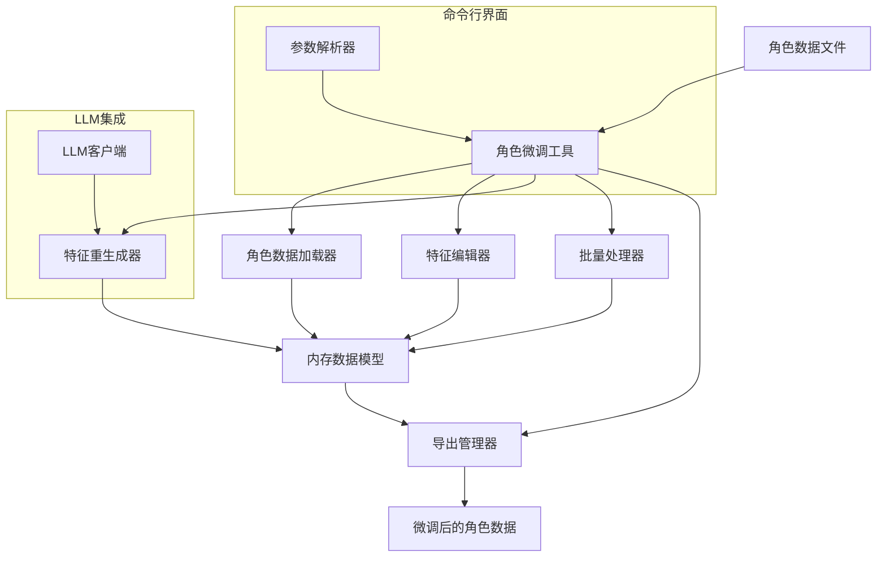
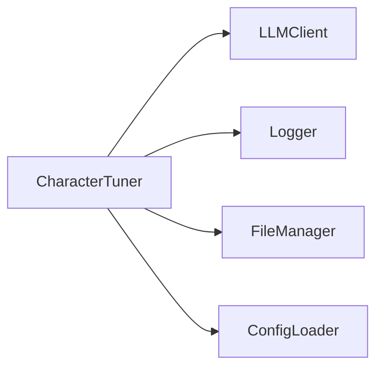
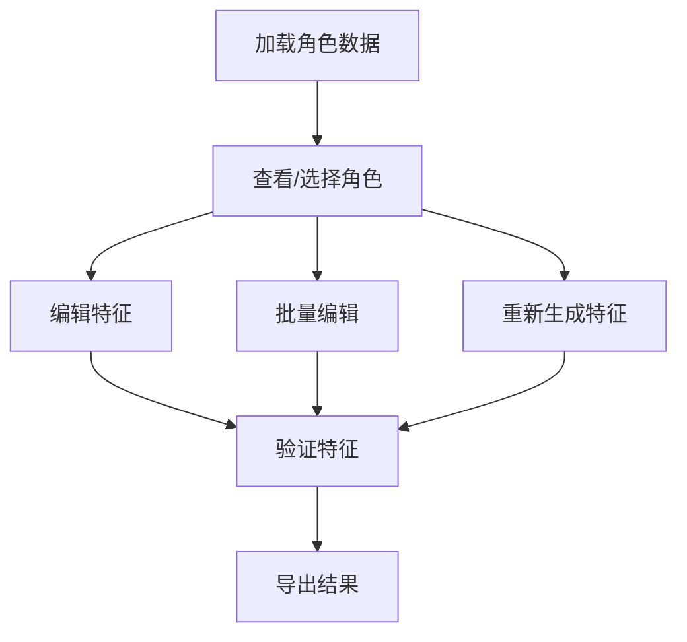
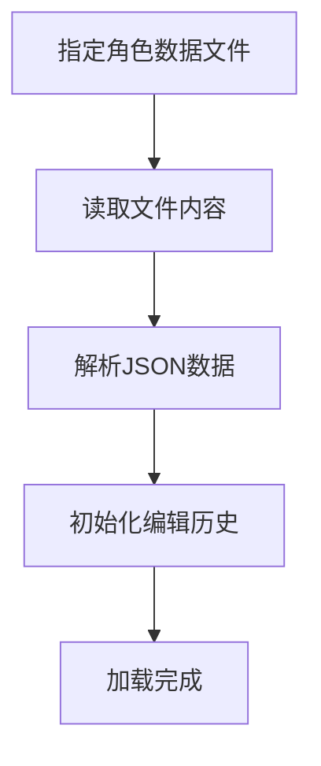
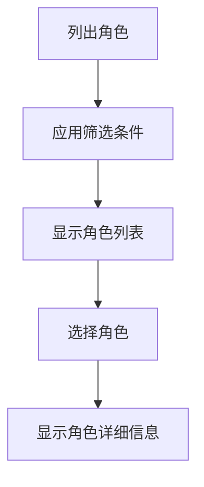
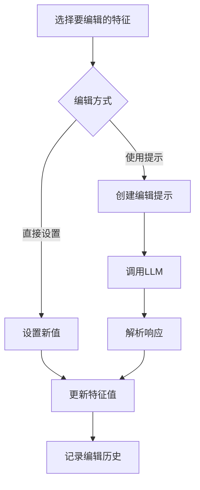
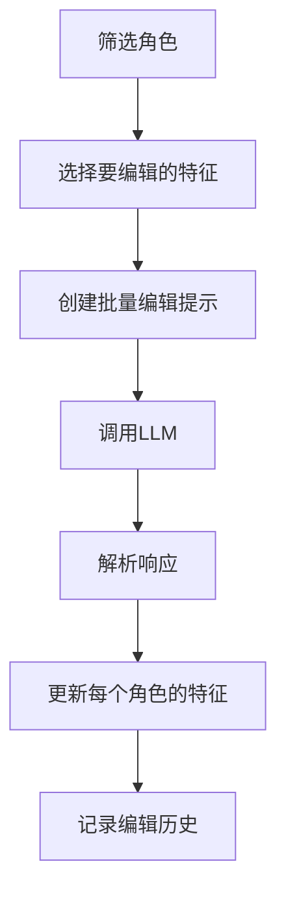
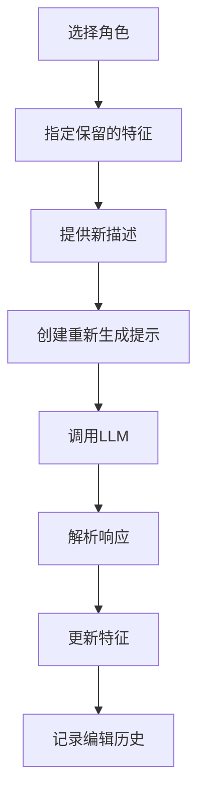
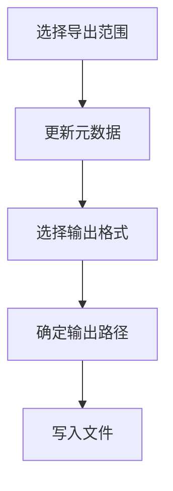

# 角色微调工具模块开发文档

## 文档信息

| 文档属性 | 值 |
|---------|-----|
| 文档名称 | 角色微调工具模块开发文档 |
| 版本号   | v0.01 |
| 创建日期 | 2025-04-11 |
| 最后更新 | 2025-04-11 |
| 状态     | 草稿 |
| 作者     | 项目团队 |

## 目录

1. [模块概述](#模块概述)
2. [架构设计](#架构设计)
3. [核心组件](#核心组件)
4. [工作流程](#工作流程)
5. [配置说明](#配置说明)
6. [使用示例](#使用示例)
7. [API文档](#API文档)
8. [数据结构](#数据结构)
9. [提示工程](#提示工程)
10. [命令行工具](#命令行工具)
11. [常见问题](#常见问题)

## 模块概述

角色微调工具模块是Visualize Fiction项目的重要组件，作为角色提取器的补充，允许用户对自动提取的角色形象进行微调和定制。该工具提供命令行界面，支持查看、编辑和重新生成角色特征，以满足用户对角色形象的特定需求。

### 主要功能

1. **角色选择功能**：列出和选择已提取的角色
2. **特征查看功能**：显示角色当前的特征描述
3. **特征编辑功能**：修改特定特征项（如脸型、眼睛、肤色等）
4. **批量编辑功能**：基于规则批量修改多个角色的特征
5. **特征重新生成功能**：基于用户提供的新描述重新生成特征
6. **特征验证功能**：检查特征描述的完整性和一致性
7. **导出功能**：将微调后的角色信息导出为JSON/YAML格式
8. **撤销/重做功能**：支持撤销和重做编辑操作

### 设计目标

1. **用户友好**：提供简单直观的命令行界面，便于用户操作
2. **灵活性**：支持多种编辑方式，满足不同的微调需求
3. **质量保证**：通过LLM辅助，确保微调后的特征描述质量
4. **可扩展性**：模块化设计，便于添加新功能
5. **可追溯性**：记录编辑历史，支持撤销和重做操作

## 架构设计

角色微调工具采用模块化架构设计，各组件职责明确，便于扩展和维护。



### 模块依赖关系



## 核心组件

### 1. CharacterTuner

CharacterTuner是模块的核心类，整合各组件功能，提供对外接口。

**主要特性**：
- 加载和解析角色数据文件
- 提供角色列表和查看功能
- 支持单个特征的编辑和重新生成
- 支持批量编辑多个角色的特征
- 管理编辑历史，支持撤销和重做
- 导出微调后的角色数据

**核心方法**：
- `load_characters`: 加载角色数据文件
- `list_characters`: 列出角色，支持筛选
- `get_character`: 获取指定角色的详细信息
- `edit_feature`: 编辑特定特征
- `regenerate_features`: 重新生成特征
- `batch_edit`: 批量编辑多个角色的特征
- `export_characters`: 导出角色数据
- `undo`: 撤销上一次编辑
- `redo`: 重做上一次撤销的编辑

### 2. 命令行界面

命令行界面负责解析用户输入，调用相应的功能。

**主要特性**：
- 支持多种子命令（list, view, edit, batch, regenerate, export等）
- 提供丰富的选项和参数
- 支持交互式和非交互式两种使用模式
- 提供帮助信息和示例

**核心命令**：
- `list`: 列出已提取的角色
- `view`: 查看指定角色的详细信息
- `edit`: 编辑指定角色的特征
- `batch`: 批量编辑多个角色
- `regenerate`: 重新生成角色特征
- `export`: 导出角色信息

### 3. 特征编辑器

特征编辑器负责单个特征的编辑功能。

**主要特性**：
- 支持直接设置特征值
- 支持使用提示重新生成特征
- 保持与其他特征的一致性
- 记录编辑历史

### 4. 特征重生成器

特征重生成器负责基于用户提供的新描述重新生成特征。

**主要特性**：
- 使用LLM重新生成特征描述
- 支持保留指定的特征
- 支持应用不同的风格
- 确保特征之间的一致性

### 5. 批量处理器

批量处理器负责处理多个角色的批量操作。

**主要特性**：
- 支持基于条件筛选角色
- 支持批量编辑特定特征
- 为每个角色生成独特的描述
- 保持与编辑指令的一致性

### 6. 导出管理器

导出管理器负责将修改后的数据导出为文件。

**主要特性**：
- 支持导出单个角色或全部角色
- 支持JSON/YAML格式
- 自动更新元数据
- 提供文件命名和路径选项

## 工作流程

角色微调工具的工作流程分为以下几个主要阶段：



### 1. 加载角色数据



### 2. 查看/选择角色



### 3. 编辑特征



### 4. 批量编辑



### 5. 重新生成特征



### 6. 导出结果



## 配置说明

角色微调工具的配置位于`config/config.yaml`文件的`text_processing.character_tuner`部分。以下是主要配置项的详细说明：

### LLM配置

```yaml
llm:
  model: "deepseek-chat"  # 使用的LLM模型
  api_key: "${API_KEY}"   # API密钥（可使用环境变量）
  api_key_file: "API.config.yaml"  # API密钥文件路径
  max_tokens: 4000        # 最大生成token数
  temperature: 0.7        # 生成温度（0-1之间，越低越确定性）
  retry_count: 3          # 请求失败时的重试次数
  timeout: 30             # 请求超时时间（秒）
  json_mode: true         # 是否启用JSON模式
```

### 微调配置

```yaml
tuning:
  history_size: 10        # 历史记录大小
  auto_validate: true     # 自动验证特征
  default_style: "realistic"  # 默认风格
```

### 输出配置

```yaml
output:
  dir: "data/characters/"  # 输出目录
  backup: true            # 是否备份原始文件
  format: "json"          # 输出格式（json/yaml）
  indent: 2               # 缩进空格数
```

### 提示模板配置

```yaml
prompts:
  feature_edit: {}        # 特征编辑提示模板
  feature_regenerate: {}  # 特征重新生成提示模板
  batch_edit: {}          # 批量编辑提示模板
```

## 使用示例

### 基本使用

```python
from src.text_processing import CharacterTuner
from src.utils.config_loader import load_config

# 加载配置
config = load_config()
tuner_config = config['text_processing']['character_tuner']

# 创建角色微调工具
tuner = CharacterTuner(tuner_config)

# 加载角色数据
characters = tuner.load_characters("data/characters/novel_characters.json")

# 列出所有主角
main_characters = tuner.list_characters({"importance": "主角"})
for char in main_characters:
    print(f"主角: {char['name']}")

# 查看特定角色
character = tuner.get_character("char001")
if character:
    print(f"角色: {character['name']}")
    if 'appearance' in character and 'structured_features' in character['appearance']:
        print(f"眼睛: {character['appearance']['structured_features'].get('eyes', '未描述')}")

# 编辑特征
tuner.edit_feature("char001", "eyes", "一双明亮的蓝色眼睛，如同深海般深邃")

# 重新生成特征
tuner.regenerate_features("char001", "更加年轻，充满活力", ["eyes", "face_shape"])

# 批量编辑
tuner.batch_edit({"attributes.gender": "女"}, "skin", "肤色更加白皙，如同瓷器般细腻")

# 导出结果
tuner.export_characters("data/characters/novel_characters_tuned.json")
```

### 命令行使用

```bash
# 列出所有角色
python -m examples.tune_characters -i data/characters/novel_characters.json list

# 查看特定角色
python -m examples.tune_characters -i data/characters/novel_characters.json view char001

# 编辑特征
python -m examples.tune_characters -i data/characters/novel_characters.json edit char001 --feature eyes --value "一双明亮的蓝色眼睛，如同深海般深邃"

# 使用提示编辑特征
python -m examples.tune_characters -i data/characters/novel_characters.json edit char001 --feature eyes --prompt "更加明亮，蓝色，有神"

# 重新生成特征
python -m examples.tune_characters -i data/characters/novel_characters.json regenerate char001 --prompt "更加年轻，充满活力" --keep eyes,face_shape

# 批量编辑
python -m examples.tune_characters -i data/characters/novel_characters.json batch --filter "attributes.gender=女" --feature skin --prompt "肤色更加白皙，如同瓷器般细腻"

# 导出结果
python -m examples.tune_characters -i data/characters/novel_characters.json export -o data/characters/novel_characters_tuned.json
```

### 交互式使用

```bash
python -m examples.tune_characters -i data/characters/novel_characters.json --interactive
```

交互式模式提供以下功能：

1. 列出角色
2. 查看角色详情
3. 编辑特征
4. 重新生成特征
5. 批量编辑
6. 导出结果
7. 撤销/重做
8. 退出

## API文档

### CharacterTuner

```python
class CharacterTuner:
    """角色微调工具，用于编辑和优化角色特征"""
    
    def __init__(self, config: Dict[str, Any], llm_client=None):
        """初始化角色微调工具
        
        Args:
            config: 配置对象
            llm_client: 大语言模型客户端，如果为None则创建新实例
        """
        
    def load_characters(self, file_path: str) -> Dict[str, Any]:
        """加载角色数据
        
        Args:
            file_path: 角色数据文件路径
            
        Returns:
            Dict[str, Any]: 角色数据库
        """
        
    def list_characters(self, filter_criteria: Optional[Dict[str, Any]] = None) -> List[Dict[str, Any]]:
        """列出角色
        
        Args:
            filter_criteria: 筛选条件，可选
            
        Returns:
            List[Dict[str, Any]]: 符合条件的角色列表
        """
        
    def get_character(self, character_id: str) -> Optional[Dict[str, Any]]:
        """获取指定角色
        
        Args:
            character_id: 角色ID
            
        Returns:
            Optional[Dict[str, Any]]: 角色信息，如果未找到则返回None
        """
        
    def edit_feature(self, character_id: str, feature_name: str, new_value: str) -> Optional[Dict[str, Any]]:
        """编辑特定特征
        
        Args:
            character_id: 角色ID
            feature_name: 特征名称
            new_value: 新的特征值
            
        Returns:
            Optional[Dict[str, Any]]: 更新后的角色信息，如果未找到则返回None
        """
        
    def edit_feature_with_prompt(self, character_id: str, feature_name: str, edit_instruction: str) -> Optional[Dict[str, Any]]:
        """使用提示编辑特征
        
        Args:
            character_id: 角色ID
            feature_name: 特征名称
            edit_instruction: 编辑指令
            
        Returns:
            Optional[Dict[str, Any]]: 更新后的角色信息，如果未找到则返回None
        """
        
    def regenerate_features(self, character_id: str, prompt: str, keep_features: Optional[List[str]] = None) -> Optional[Dict[str, Any]]:
        """重新生成特征
        
        Args:
            character_id: 角色ID
            prompt: 生成提示
            keep_features: 保留的特征列表，可选
            
        Returns:
            Optional[Dict[str, Any]]: 更新后的角色信息，如果未找到则返回None
        """
        
    def batch_edit(self, filter_criteria: Dict[str, Any], feature_name: str, edit_instruction: str) -> List[Dict[str, Any]]:
        """批量编辑特征
        
        Args:
            filter_criteria: 筛选条件
            feature_name: 特征名称
            edit_instruction: 编辑指令
            
        Returns:
            List[Dict[str, Any]]: 更新后的角色列表
        """
        
    def export_characters(self, output_path: Optional[str] = None, character_id: Optional[str] = None) -> str:
        """导出角色信息
        
        Args:
            output_path: 输出文件路径，可选
            character_id: 角色ID，如果提供则只导出该角色，可选
            
        Returns:
            str: 导出文件路径
        """
        
    def undo(self) -> bool:
        """撤销上一次编辑
        
        Returns:
            bool: 是否成功撤销
        """
        
    def redo(self) -> bool:
        """重做上一次撤销的编辑
        
        Returns:
            bool: 是否成功重做
        """
        
    def validate_features(self, character_id: str) -> Dict[str, Any]:
        """验证特征描述的完整性和一致性
        
        Args:
            character_id: 角色ID
            
        Returns:
            Dict[str, Any]: 验证结果
        """
```

## 数据结构

### 输入数据

角色微调工具的输入是角色提取器生成的角色数据文件，包含角色列表和元数据：

```json
{
  "characters": [
    {
      "id": "char001",
      "name": "角色名称",
      "aliases": ["别名1", "别名2"],
      "importance": "主角/配角/次要角色",
      "first_appearance": "章节标题",
      "attributes": {
        "gender": "性别",
        "age": "年龄",
        "occupation": "职业"
      },
      "appearance": {
        "face": "面部特征描述",
        "body": "体型特征描述",
        "clothing": "服饰特征描述",
        "structured_features": {
          "face_shape": "脸型描述",
          "eyes": "眼睛描述",
          "nose": "鼻子描述",
          "mouth": "嘴巴描述",
          "eyebrows": "眉毛描述",
          "skin": "肤色和肤质描述",
          "distinctive_features": "其他显著特征"
        },
        "text_references": [
          {
            "description": "原文中的描述片段",
            "context": "描述出现的上下文"
          }
        ],
        "features_standardized": true
      }
    }
  ],
  "metadata": {
    "book_title": "小说标题",
    "total_characters": 10,
    "main_characters": 2,
    "extraction_date": "2025-04-11",
    "version": "0.01"
  }
}
```

### 输出数据

角色微调工具的输出是微调后的角色数据，添加了编辑历史和用户编辑标记：

```json
{
  "characters": [
    {
      "id": "char001",
      "name": "角色名称",
      "aliases": ["别名1", "别名2"],
      "importance": "主角/配角/次要角色",
      "attributes": {
        "gender": "性别",
        "age": "年龄",
        "occupation": "职业"
      },
      "appearance": {
        "face": "面部特征描述",
        "structured_features": {
          "face_shape": "脸型描述",
          "eyes": "眼睛描述",
          "nose": "鼻子描述",
          "mouth": "嘴巴描述",
          "eyebrows": "眉毛描述",
          "skin": "肤色和肤质描述",
          "distinctive_features": "其他显著特征"
        },
        "body": "体型特征描述",
        "clothing": "服饰特征描述",
        "features_standardized": true,
        "user_edited": true,
        "edit_history": [
          {
            "timestamp": "2025-04-11T12:34:56",
            "feature": "eyes",
            "old_value": "旧的描述",
            "new_value": "新的描述"
          },
          {
            "timestamp": "2025-04-11T12:35:30",
            "operation": "regenerate",
            "prompt": "更加年轻，充满活力",
            "keep_features": ["eyes", "face_shape"]
          }
        ]
      }
    }
  ],
  "metadata": {
    "book_title": "小说标题",
    "total_characters": 10,
    "main_characters": 2,
    "extraction_date": "2025-04-11",
    "last_edited": "2025-04-11T12:35:30",
    "version": "0.01"
  },
  "edit_history": [
    {
      "timestamp": "2025-04-11T12:34:56",
      "operation": "edit_feature",
      "character_id": "char001",
      "details": {
        "feature": "eyes",
        "old_value": "旧的描述",
        "new_value": "新的描述"
      }
    },
    {
      "timestamp": "2025-04-11T12:35:30",
      "operation": "regenerate_features",
      "character_id": "char001",
      "details": {
        "prompt": "更加年轻，充满活力",
        "keep_features": ["eyes", "face_shape"]
      }
    }
  ]
}
```

## 提示工程

角色微调工具使用精心设计的提示工程来引导LLM生成高质量的特征描述。以下是主要提示的设计思路和关键点：

### 1. 特征编辑提示

特征编辑提示旨在根据用户提供的编辑指令，修改特定角色特征的描述。

**设计思路**：
- 提供角色的基本信息和当前特征描述，作为上下文
- 明确指定要编辑的特征和编辑指令
- 要求保持与角色其他特征的一致性
- 要求返回修改后的特征描述和修改理由

**关键优化点**：
- 提供角色的性别、年龄、职业等基本属性，便于生成符合角色特点的描述
- 提供当前特征描述和其他相关特征，确保一致性
- 使用JSON模式，确保输出格式一致
- 要求提供修改理由，便于理解修改的考虑因素

### 2. 特征重新生成提示

特征重新生成提示旨在根据用户提供的新描述，重新生成角色的外观特征。

**设计思路**：
- 提供角色的基本信息和当前外观描述，作为上下文
- 明确指定需要保留的特征
- 要求根据用户提供的新描述重新生成其他特征
- 要求保持特征之间的一致性

**关键优化点**：
- 提供角色的性别、年龄、职业等基本属性，便于生成符合角色特点的描述
- 提供当前外观描述，作为参考
- 明确指定需要保留的特征，避免覆盖用户希望保留的部分
- 使用JSON模式，确保输出格式一致

### 3. 批量编辑提示

批量编辑提示旨在根据用户提供的编辑指令，为多个角色修改特定特征的描述。

**设计思路**：
- 提供角色列表和每个角色的基本信息，作为上下文
- 明确指定要编辑的特征和编辑指令
- 要求为每个角色生成独特的描述
- 要求保持与编辑指令的一致性

**关键优化点**：
- 提供角色的性别、年龄等基本属性，便于生成符合角色特点的描述
- 提供当前特征描述，作为参考
- 要求为每个角色生成独特的描述，避免重复或模板化
- 使用JSON模式，确保输出格式一致
- 要求提供批量修改的整体考虑因素，便于理解修改的思路

## 命令行工具

项目提供了一个命令行工具用于微调角色特征：

```bash
python -m examples.tune_characters [options] <command> [command_options]
```

### 全局选项

- `-i, --input FILE`：指定输入的角色数据文件
- `-o, --output FILE`：指定输出文件
- `-c, --config FILE`：指定配置文件
- `-v, --verbose`：显示详细日志
- `--interactive`：使用交互式模式

### 命令

#### list

列出已提取的角色。

```bash
python -m examples.tune_characters -i characters.json list [--filter FILTER]
```

选项：
- `--filter FILTER`：筛选条件，格式为"key=value"，支持多个条件（逗号分隔）

#### view

查看指定角色的详细信息。

```bash
python -m examples.tune_characters -i characters.json view <character_id>
```

#### edit

编辑指定角色的特征。

```bash
python -m examples.tune_characters -i characters.json edit <character_id> [options]
```

选项：
- `--feature FEATURE`：指定要编辑的特征（face_shape, eyes, etc.）
- `--value VALUE`：设置特征的新值
- `--prompt PROMPT`：使用提示重新生成特征

#### batch

批量编辑多个角色。

```bash
python -m examples.tune_characters -i characters.json batch [options]
```

选项：
- `--filter FILTER`：筛选要编辑的角色（如 "importance=主角"）
- `--feature FEATURE`：指定要编辑的特征
- `--value VALUE`：设置特征的新值
- `--prompt PROMPT`：使用提示批量修改特征

#### regenerate

重新生成角色特征。

```bash
python -m examples.tune_characters -i characters.json regenerate <character_id> [options]
```

选项：
- `--keep FEATURES`：保留的特征列表（逗号分隔）
- `--prompt PROMPT`：重新生成的提示
- `--style STYLE`：应用的风格

#### export

导出角色信息。

```bash
python -m examples.tune_characters -i characters.json export [character_id] [options]
```

选项：
- `-o, --output FILE`：指定输出文件
- `--format FORMAT`：指定输出格式（json/yaml）

#### undo

撤销上一次编辑。

```bash
python -m examples.tune_characters -i characters.json undo
```

#### redo

重做上一次撤销的编辑。

```bash
python -m examples.tune_characters -i characters.json redo
```

## 常见问题

### 1. 如何处理特征描述不完整的角色？

**问题**：从角色提取器提取的角色特征描述不完整，缺少某些特征项。

**解决方案**：
- 使用`regenerate_features`命令重新生成特征，提供更详细的描述
- 使用`edit_feature`命令手动添加缺失的特征
- 使用`validate_features`命令检查特征的完整性，并根据建议进行修复

### 2. 如何保持角色特征的一致性？

**问题**：编辑某个特征后，与其他特征不一致。

**解决方案**：
- 使用`regenerate_features`命令重新生成特征，保留已编辑的特征
- 使用`--prompt`参数提供一致性指导，如"保持与眼睛颜色一致的整体风格"
- 使用`validate_features`命令检查特征的一致性，并根据建议进行修复

### 3. 如何批量修改多个角色的特征？

**问题**：需要为多个角色应用相似的特征修改。

**解决方案**：
- 使用`batch`命令批量编辑特征
- 使用`--filter`参数筛选要编辑的角色
- 使用`--prompt`参数提供编辑指令，确保为每个角色生成独特的描述

### 4. 如何撤销错误的编辑？

**问题**：进行了错误的编辑，需要撤销。

**解决方案**：
- 使用`undo`命令撤销上一次编辑
- 如果需要撤销多次编辑，可以多次使用`undo`命令
- 如果撤销后想重做，可以使用`redo`命令

### 5. 如何导出特定角色的信息？

**问题**：只需要导出某个特定角色的信息，而不是整个角色数据库。

**解决方案**：
- 使用`export`命令导出角色信息，指定角色ID
- 例如：`python -m examples.tune_characters -i characters.json export char001 -o char001.json`

### 6. 如何在交互式模式下使用工具？

**问题**：命令行参数太复杂，希望有更简单的使用方式。

**解决方案**：
- 使用`--interactive`参数启动交互式模式
- 在交互式模式下，可以通过菜单选择操作
- 交互式模式会提供更详细的帮助信息和示例
