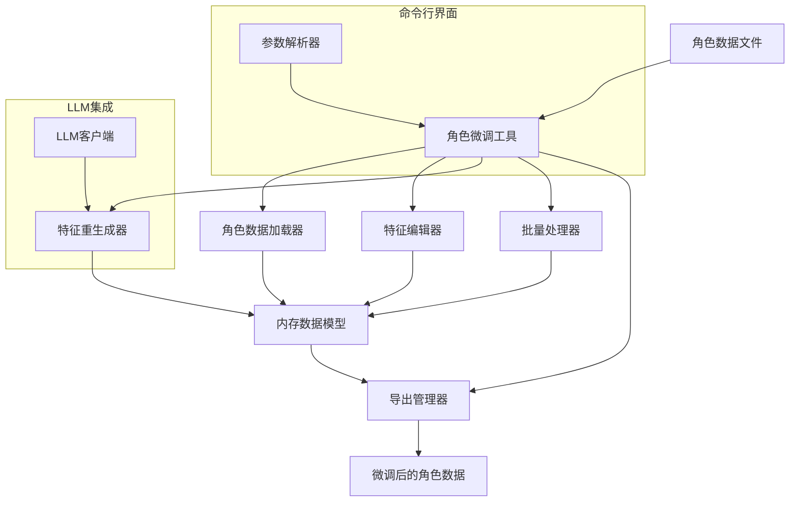

# 角色微调工具开发规划

## 一、功能概述

角色微调工具将专注于以下核心功能：

1. **角色选择功能**：列出和选择已提取的角色
2. **特征查看功能**：显示角色当前的特征描述
3. **特征编辑功能**：修改特定特征项（如脸型、眼睛、肤色等）
4. **批量编辑功能**：基于规则批量修改多个角色的特征
5. **特征重新生成功能**：基于用户提供的新描述重新生成特征
6. **特征验证功能**：检查特征描述的完整性和一致性
7. **导出功能**：将微调后的角色信息导出为JSON/YAML格式
8. **撤销/重做功能**：支持撤销和重做编辑操作

## 二、技术方案

### 1. 架构设计



### 2. 核心组件

1. **命令行界面**：处理用户输入和参数解析
2. **角色数据加载器**：读取和解析角色数据文件
3. **特征编辑器**：提供单个特征的编辑功能
4. **特征重生成器**：使用LLM重新生成特征描述
5. **批量处理器**：处理多个角色的批量操作
6. **导出管理器**：将修改后的数据导出为文件
7. **历史记录管理器**：管理编辑历史，支持撤销/重做

### 3. 数据结构设计

角色微调工具将使用与角色提取器相同的数据结构，并添加编辑历史记录：

```json
{
  "characters": [
    {
      "id": "char001",
      "name": "角色名称",
      "aliases": ["别名1", "别名2"],
      "importance": "主角/配角/次要角色",
      "attributes": {
        "gender": "性别",
        "age": "年龄",
        "occupation": "职业"
      },
      "appearance": {
        "face": "面部特征描述",
        "structured_features": {
          "face_shape": "脸型描述",
          "eyes": "眼睛描述",
          "nose": "鼻子描述",
          "mouth": "嘴巴描述",
          "eyebrows": "眉毛描述",
          "skin": "肤色和肤质描述",
          "distinctive_features": "其他显著特征"
        },
        "body": "体型特征描述",
        "clothing": "服饰特征描述",
        "features_standardized": true,
        "user_edited": true,
        "edit_history": [
          {
            "timestamp": "2025-04-11T12:34:56",
            "feature": "eyes",
            "old_value": "旧的描述",
            "new_value": "新的描述"
          }
        ]
      }
    }
  ],
  "metadata": {
    "book_title": "小说标题",
    "total_characters": "角色总数",
    "main_characters": "主要角色数",
    "extraction_date": "提取日期",
    "last_edited": "最后编辑日期",
    "version": "版本号"
  },
  "edit_history": [
    {
      "timestamp": "2025-04-11T12:34:56",
      "operation": "edit_feature",
      "character_id": "char001",
      "feature": "eyes",
      "old_value": "旧的描述",
      "new_value": "新的描述"
    }
  ]
}
```

## 三、优化的提示工程设计

为了实现高质量的特征重新生成，我们将设计专门的提示模板：

### 1. 特征编辑提示

```python
def create_feature_edit_prompt(character_info, feature_name, edit_instruction):
    system_prompt = """
    你是一个专业的文学角色设计师，擅长编辑和优化角色的外观特征描述。
    你的任务是根据提供的编辑指令，修改特定角色特征的描述。
    请保持与角色其他特征的一致性，并确保描述足够详细和生动。
    请严格按照指定的JSON格式返回结果，不要添加任何额外的解释或评论。
    """
    
    user_prompt = f"""
    请根据以下编辑指令，修改角色"{character_info['name']}"的"{feature_name}"特征描述:
    
    角色基本信息:
    - 性别: {character_info.get('attributes', {}).get('gender', '未知')}
    - 年龄: {character_info.get('attributes', {}).get('age', '未知')}
    - 职业: {character_info.get('attributes', {}).get('occupation', '未知')}
    
    当前特征描述:
    {character_info.get('appearance', {}).get('structured_features', {}).get(feature_name, '无')}
    
    其他相关特征:
    {json.dumps(character_info.get('appearance', {}).get('structured_features', {}), ensure_ascii=False, indent=2)}
    
    编辑指令:
    {edit_instruction}
    
    请以JSON格式返回修改后的特征描述:
    
    ```json
    {{
      "edited_feature": {{
        "{feature_name}": "修改后的特征描述"
      }},
      "reasoning": "修改理由和考虑因素"
    }}
    ```
    
    重要说明:
    1. 保持与角色其他特征的一致性
    2. 确保描述足够详细和生动，适合用于图像生成
    3. 考虑角色的性别、年龄、职业等基本属性
    4. 确保JSON格式正确，可以被直接解析
    """
    
    return {"system": system_prompt, "user": user_prompt}
```

### 2. 特征重新生成提示

```python
def create_feature_regenerate_prompt(character_info, user_prompt, keep_features=None):
    system_prompt = """
    你是一个专业的文学角色设计师，擅长创建详细的角色外观描述。
    你的任务是根据用户提供的描述和已有信息，重新生成角色的外观特征。
    请保留用户指定的特征，仅重新生成其他特征。
    请严格按照指定的JSON格式返回结果，不要添加任何额外的解释或评论。
    """
    
    # 准备需要保留的特征
    keep_features = keep_features or []
    preserved_features = {}
    for feature in keep_features:
        if feature in character_info.get('appearance', {}).get('structured_features', {}):
            preserved_features[feature] = character_info['appearance']['structured_features'][feature]
    
    user_prompt_text = f"""
    请根据以下描述，重新生成角色"{character_info['name']}"的外观特征:
    
    角色基本信息:
    - 性别: {character_info.get('attributes', {}).get('gender', '未知')}
    - 年龄: {character_info.get('attributes', {}).get('age', '未知')}
    - 职业: {character_info.get('attributes', {}).get('occupation', '未知')}
    
    当前外观描述:
    {character_info.get('appearance', {}).get('face', '无')}
    
    需要保留的特征:
    {json.dumps(preserved_features, ensure_ascii=False, indent=2)}
    
    用户提供的新描述:
    {user_prompt}
    
    请以JSON格式返回重新生成的特征:
    
    ```json
    {{
      "regenerated_appearance": {{
        "face": "完整的面部描述段落",
        "structured_features": {{
          "face_shape": "脸型描述",
          "eyes": "眼睛描述",
          "nose": "鼻子描述",
          "mouth": "嘴巴描述",
          "eyebrows": "眉毛描述",
          "skin": "肤色和肤质描述",
          "distinctive_features": "其他显著特征"
        }}
      }}
    }}
    ```
    
    重要说明:
    1. 保留指定的特征，不要修改它们
    2. 根据用户提供的新描述重新生成其他特征
    3. 确保描述足够详细和生动，适合用于图像生成
    4. 保持特征之间的一致性
    5. 确保JSON格式正确，可以被直接解析
    """
    
    return {"system": system_prompt, "user": user_prompt_text}
```

### 3. 批量编辑提示

```python
def create_batch_edit_prompt(characters_info, feature_name, edit_instruction):
    system_prompt = """
    你是一个专业的文学角色设计师，擅长批量编辑和优化角色的外观特征描述。
    你的任务是根据提供的编辑指令，为多个角色修改特定特征的描述。
    请为每个角色生成独特的描述，同时保持与编辑指令的一致性。
    请严格按照指定的JSON格式返回结果，不要添加任何额外的解释或评论。
    """
    
    # 准备角色信息摘要
    characters_summary = []
    for char in characters_info:
        summary = {
            "id": char.get('id', ''),
            "name": char.get('name', ''),
            "gender": char.get('attributes', {}).get('gender', '未知'),
            "age": char.get('attributes', {}).get('age', '未知'),
            "current_feature": char.get('appearance', {}).get('structured_features', {}).get(feature_name, '无')
        }
        characters_summary.append(summary)
    
    user_prompt = f"""
    请根据以下编辑指令，为多个角色修改"{feature_name}"特征描述:
    
    角色列表:
    {json.dumps(characters_summary, ensure_ascii=False, indent=2)}
    
    编辑指令:
    {edit_instruction}
    
    请以JSON格式返回修改后的特征描述:
    
    ```json
    {{
      "batch_edits": [
        {{
          "character_id": "角色ID",
          "character_name": "角色名称",
          "edited_feature": "修改后的特征描述"
        }}
      ],
      "reasoning": "批量修改的整体考虑因素"
    }}
    ```
    
    重要说明:
    1. 为每个角色生成独特的描述，避免重复或模板化
    2. 考虑每个角色的性别、年龄等基本属性
    3. 保持与编辑指令的一致性
    4. 确保JSON格式正确，可以被直接解析
    """
    
    return {"system": system_prompt, "user": user_prompt}
```

## 四、命令行界面设计

角色微调工具将提供以下命令行接口：

```
# 基本用法
python -m examples.tune_characters [options] <command> [command_options]

# 命令列表
commands:
  list                     列出已提取的角色
  view <character_id>      查看指定角色的详细信息
  edit <character_id>      编辑指定角色的特征
  batch                    批量编辑多个角色
  regenerate <character_id> 重新生成角色特征
  export [character_id]    导出角色信息
  
# 全局选项
options:
  -i, --input FILE         指定输入的角色数据文件
  -o, --output FILE        指定输出文件
  -c, --config FILE        指定配置文件
  -v, --verbose            显示详细日志
  --interactive            使用交互式模式
  
# 编辑命令选项
edit options:
  --feature FEATURE        指定要编辑的特征（face_shape, eyes, etc.）
  --value VALUE            设置特征的新值
  --prompt PROMPT          使用提示重新生成特征
  
# 批量编辑命令选项
batch options:
  --filter FILTER          筛选要编辑的角色（如 "importance=主角"）
  --feature FEATURE        指定要编辑的特征
  --value VALUE            设置特征的新值
  --prompt PROMPT          使用提示批量修改特征
  
# 重新生成命令选项
regenerate options:
  --keep FEATURES          保留的特征列表（逗号分隔）
  --prompt PROMPT          重新生成的提示
  --style STYLE            应用的风格
```

## 五、CharacterTuner类实现

```python
import json
import os
import argparse
import datetime
from typing import Dict, List, Any, Optional

from ..utils.logger import get_logger
from ..utils.file_manager import ensure_dir

class CharacterTuner:
    """角色微调工具，用于编辑和优化角色特征"""
    
    def __init__(self, config: Dict[str, Any], llm_client=None):
        """初始化角色微调工具
        
        Args:
            config: 配置对象
            llm_client: 大语言模型客户端，如果为None则创建新实例
        """
        self.config = config
        self.logger = get_logger(__name__)
        
        # 如果未提供LLM客户端，创建一个新实例
        if llm_client is None:
            from ..text_processing.llm_client import LLMClient
            llm_config = config.get('llm', {})
            self.llm_client = LLMClient(llm_config)
        else:
            self.llm_client = llm_client
            
        # 加载提示模板
        self.prompts = config.get('prompts', {})
        
        # 初始化数据
        self.characters_data = None
        self.edit_history = []
        self.history_size = config.get('tuning', {}).get('history_size', 10)
        
        self.logger.info("角色微调工具初始化完成")
    
    def load_characters(self, file_path: str) -> Dict[str, Any]:
        """加载角色数据
        
        Args:
            file_path: 角色数据文件路径
            
        Returns:
            Dict[str, Any]: 角色数据库
        """
        try:
            with open(file_path, 'r', encoding='utf-8') as f:
                self.characters_data = json.load(f)
                
            # 初始化编辑历史
            if 'edit_history' not in self.characters_data:
                self.characters_data['edit_history'] = []
                
            self.logger.info(f"从 {file_path} 加载了 {len(self.characters_data.get('characters', []))} 个角色")
            return self.characters_data
        except Exception as e:
            self.logger.error(f"加载角色数据失败: {e}")
            raise
    
    def list_characters(self, filter_criteria: Optional[Dict[str, Any]] = None) -> List[Dict[str, Any]]:
        """列出角色
        
        Args:
            filter_criteria: 筛选条件，可选
            
        Returns:
            List[Dict[str, Any]]: 符合条件的角色列表
        """
        if not self.characters_data:
            self.logger.error("未加载角色数据")
            return []
            
        characters = self.characters_data.get('characters', [])
        
        # 应用筛选条件
        if filter_criteria:
            filtered_characters = []
            for char in characters:
                match = True
                for key, value in filter_criteria.items():
                    # 处理嵌套属性，如 "attributes.gender"
                    if '.' in key:
                        parts = key.split('.')
                        char_value = char
                        for part in parts:
                            if part in char_value:
                                char_value = char_value[part]
                            else:
                                char_value = None
                                break
                    else:
                        char_value = char.get(key)
                        
                    if char_value != value:
                        match = False
                        break
                        
                if match:
                    filtered_characters.append(char)
            return filtered_characters
        else:
            return characters
    
    def get_character(self, character_id: str) -> Optional[Dict[str, Any]]:
        """获取指定角色
        
        Args:
            character_id: 角色ID
            
        Returns:
            Optional[Dict[str, Any]]: 角色信息，如果未找到则返回None
        """
        if not self.characters_data:
            self.logger.error("未加载角色数据")
            return None
            
        for char in self.characters_data.get('characters', []):
            if char.get('id') == character_id:
                return char
                
        self.logger.warning(f"未找到ID为 {character_id} 的角色")
        return None
    
    def edit_feature(self, character_id: str, feature_name: str, new_value: str) -> Optional[Dict[str, Any]]:
        """编辑特定特征
        
        Args:
            character_id: 角色ID
            feature_name: 特征名称
            new_value: 新的特征值
            
        Returns:
            Optional[Dict[str, Any]]: 更新后的角色信息，如果未找到则返回None
        """
        character = self.get_character(character_id)
        if not character:
            return None
            
        # 确保appearance和structured_features存在
        if 'appearance' not in character:
            character['appearance'] = {}
        if 'structured_features' not in character['appearance']:
            character['appearance']['structured_features'] = {}
            
        # 保存旧值用于历史记录
        old_value = character['appearance']['structured_features'].get(feature_name, '')
        
        # 更新特征值
        character['appearance']['structured_features'][feature_name] = new_value
        
        # 标记为用户编辑
        character['appearance']['user_edited'] = True
        
        # 添加到角色的编辑历史
        if 'edit_history' not in character['appearance']:
            character['appearance']['edit_history'] = []
            
        character['appearance']['edit_history'].append({
            'timestamp': datetime.datetime.now().isoformat(),
            'feature': feature_name,
            'old_value': old_value,
            'new_value': new_value
        })
        
        # 添加到全局编辑历史
        self._add_to_history('edit_feature', character_id, {
            'feature': feature_name,
            'old_value': old_value,
            'new_value': new_value
        })
        
        self.logger.info(f"已编辑角色 '{character.get('name', character_id)}' 的 {feature_name} 特征")
        return character
    
    def regenerate_features(self, character_id: str, prompt: str, keep_features: Optional[List[str]] = None) -> Optional[Dict[str, Any]]:
        """重新生成特征
        
        Args:
            character_id: 角色ID
            prompt: 生成提示
            keep_features: 保留的特征列表，可选
            
        Returns:
            Optional[Dict[str, Any]]: 更新后的角色信息，如果未找到则返回None
        """
        character = self.get_character(character_id)
        if not character:
            return None
            
        # 创建重新生成提示
        regenerate_prompt = self._create_feature_regenerate_prompt(character, prompt, keep_features)
        
        try:
            # 调用LLM重新生成特征
            response = self.llm_client.query(regenerate_prompt, json_mode=True)
            regenerated = json.loads(response)
            
            # 保存旧值用于历史记录
            old_appearance = character.get('appearance', {}).copy()
            
            # 更新特征
            if 'regenerated_appearance' in regenerated:
                # 确保appearance存在
                if 'appearance' not in character:
                    character['appearance'] = {}
                    
                # 更新面部描述
                if 'face' in regenerated['regenerated_appearance']:
                    character['appearance']['face'] = regenerated['regenerated_appearance']['face']
                    
                # 更新结构化特征
                if 'structured_features' in regenerated['regenerated_appearance']:
                    # 如果需要保留某些特征，先保存它们
                    preserved_features = {}
                    if keep_features:
                        for feature in keep_features:
                            if feature in character.get('appearance', {}).get('structured_features', {}):
                                preserved_features[feature] = character['appearance']['structured_features'][feature]
                    
                    # 更新结构化特征
                    if 'structured_features' not in character['appearance']:
                        character['appearance']['structured_features'] = {}
                        
                    character['appearance']['structured_features'] = regenerated['regenerated_appearance']['structured_features']
                    
                    # 恢复保留的特征
                    for feature, value in preserved_features.items():
                        character['appearance']['structured_features'][feature] = value
                
                # 标记为用户编辑
                character['appearance']['user_edited'] = True
                
                # 添加到角色的编辑历史
                if 'edit_history' not in character['appearance']:
                    character['appearance']['edit_history'] = []
                    
                character['appearance']['edit_history'].append({
                    'timestamp': datetime.datetime.now().isoformat(),
                    'operation': 'regenerate',
                    'prompt': prompt,
                    'keep_features': keep_features
                })
                
                # 添加到全局编辑历史
                self._add_to_history('regenerate_features', character_id, {
                    'prompt': prompt,
                    'keep_features': keep_features,
                    'old_appearance': old_appearance
                })
                
                self.logger.info(f"已重新生成角色 '{character.get('name', character_id)}' 的特征")
                return character
            else:
                self.logger.error(f"重新生成特征失败: 响应格式不正确")
                return None
        except Exception as e:
            self.logger.error(f"重新生成特征失败: {e}")
            return None
    
    def batch_edit(self, filter_criteria: Dict[str, Any], feature_name: str, edit_instruction: str) -> List[Dict[str, Any]]:
        """批量编辑特征
        
        Args:
            filter_criteria: 筛选条件
            feature_name: 特征名称
            edit_instruction: 编辑指令
            
        Returns:
            List[Dict[str, Any]]: 更新后的角色列表
        """
        # 筛选角色
        characters = self.list_characters(filter_criteria)
        if not characters:
            self.logger.warning("没有符合条件的角色")
            return []
            
        # 创建批量编辑提示
        batch_prompt = self._create_batch_edit_prompt(characters, feature_name, edit_instruction)
        
        try:
            # 调用LLM进行批量编辑
            response = self.llm_client.query(batch_prompt, json_mode=True)
            batch_edits = json.loads(response)
            
            updated_characters = []
            if 'batch_edits' in batch_edits:
                for edit in batch_edits['batch_edits']:
                    character_id = edit.get('character_id')
                    edited_feature = edit.get('edited_feature')
                    
                    if character_id and edited_feature:
                        # 更新特征
                        updated_char = self.edit_feature(character_id, feature_name, edited_feature)
                        if updated_char:
                            updated_characters.append(updated_char)
                
                self.logger.info(f"已批量编辑 {len(updated_characters)}/{len(characters)} 个角色的 {feature_name} 特征")
                return updated_characters
            else:
                self.logger.error(f"批量编辑失败: 响应格式不正确")
                return []
        except Exception as e:
            self.logger.error(f"批量编辑失败: {e}")
            return []
    
    def export_characters(self, output_path: Optional[str] = None, character_id: Optional[str] = None) -> str:
        """导出角色信息
        
        Args:
            output_path: 输出文件路径，可选
            character_id: 角色ID，如果提供则只导出该角色，可选
            
        Returns:
            str: 导出文件路径
        """
        if not self.characters_data:
            self.logger.error("未加载角色数据")
            raise ValueError("未加载角色数据")
            
        # 如果指定了角色ID，只导出该角色
        if character_id:
            character = self.get_character(character_id)
            if not character:
                raise ValueError(f"未找到ID为 {character_id} 的角色")
                
            export_data = {
                'characters': [character],
                'metadata': self.characters_data.get('metadata', {}).copy()
            }
            export_data['metadata']['total_characters'] = 1
        else:
            export_data = self.characters_data.copy()
            
        # 更新元数据
        if 'metadata' not in export_data:
            export_data['metadata'] = {}
            
        export_data['metadata']['last_edited'] = datetime.datetime.now().isoformat()
        
        # 确定输出路径
        if not output_path:
            # 使用默认输出目录和文件名
            output_dir = self.config.get('output', {}).get('dir', 'data/characters/')
            ensure_dir(output_dir)
            
            if character_id:
                filename = f"{character_id}_{datetime.datetime.now().strftime('%Y%m%d_%H%M%S')}.json"
            else:
                book_title = export_data['metadata'].get('book_title', 'characters')
                filename = f"{book_title}_tuned_{datetime.datetime.now().strftime('%Y%m%d_%H%M%S')}.json"
                
            output_path = os.path.join(output_dir, filename)
        
        # 导出文件
        try:
            with open(output_path, 'w', encoding='utf-8') as f:
                json.dump(export_data, f, ensure_ascii=False, indent=2)
                
            self.logger.info(f"已导出角色信息到 {output_path}")
            return output_path
        except Exception as e:
            self.logger.error(f"导出角色信息失败: {e}")
            raise
    
    def undo(self) -> bool:
        """撤销上一次编辑
        
        Returns:
            bool: 是否成功撤销
        """
        if not self.characters_data or not self.characters_data.get('edit_history'):
            self.logger.warning("没有可撤销的编辑")
            return False
            
        # 获取最后一次编辑
        last_edit = self.characters_data['edit_history'].pop()
        
        # 根据操作类型执行撤销
        operation = last_edit.get('operation')
        character_id = last_edit.get('character_id')
        
        if operation == 'edit_feature':
            # 撤销特征编辑
            character = self.get_character(character_id)
            if character and 'appearance' in character and 'structured_features' in character['appearance']:
                feature = last_edit.get('details', {}).get('feature')
                old_value = last_edit.get('details', {}).get('old_value')
                
                if feature:
                    character['appearance']['structured_features'][feature] = old_value
                    self.logger.info(f"已撤销对角色 '{character.get('name', character_id)}' 的 {feature} 特征的编辑")
                    return True
        
        elif operation == 'regenerate_features':
            # 撤销特征重新生成
            character = self.get_character(character
