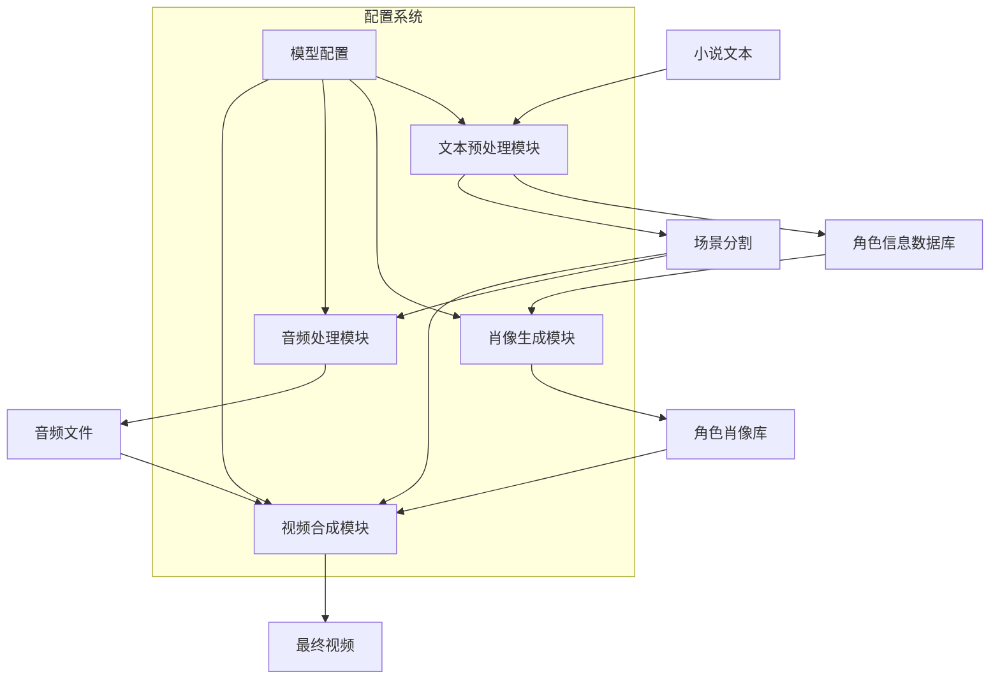
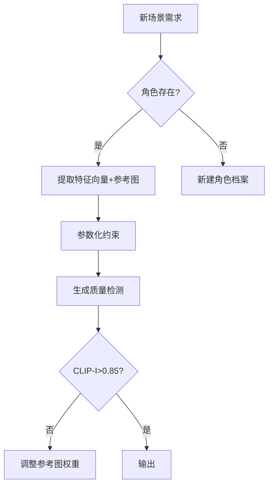

# Visualize Fiction 开发计划文档 v0.01

## 文档信息

| 文档属性 | 值 |
|---------|-----|
| 文档名称 | Visualize Fiction 开发计划文档 |
| 版本号   | v0.01 |
| 创建日期 | 2025-04-11 |
| 最后更新 | 2025-04-11 |
| 状态     | 草稿 |
| 作者     | 项目团队 |

## 目录

1. [项目概述](#项目概述)
2. [开发阶段划分](#开发阶段划分)
3. [模块开发计划](#模块开发计划)
   - [文本预处理模块](#文本预处理模块)
   - [肖像生成模块](#肖像生成模块)
   - [音频处理模块](#音频处理模块)
   - [视频合成模块](#视频合成模块)
4. [技术栈选型](#技术栈选型)
5. [系统架构](#系统架构)
6. [接口设计](#接口设计)
7. [配置文件设计](#配置文件设计)
8. [开发规范](#开发规范)
9. [风险评估](#风险评估)
10. [附录](#附录)

## 项目概述

Visualize Fiction 是一个基于uv管理的小说可视化项目，目标是实现将小说生成视频的环节自动化，让创作者只用注意其中的几个关键点便可以完成视频的生成。

**当前工作流假设小说人物肖像不会出现太大改动**

## 开发阶段划分

| 阶段 | 时间预估 | 主要任务 | 技术选型 | 负责人 |
|------|----------|----------|----------|--------|
| 需求分析 | 1周 | 确定项目范围、用户需求、功能列表 | - | 项目经理 |
| 架构设计 | 2周 | 系统架构设计、数据流设计、接口设计 | - | 架构师 |
| 开发实现 | 8周 | 各模块实现 | 见下文 | 开发团队 |
| 测试 | 2周 | 单元测试、集成测试、用户测试 | pytest, unittest | 测试团队 |
| 部署上线 | 1周 | 系统部署、文档编写 | Docker, K8s | 运维团队 |

### 里程碑计划

| 里程碑 | 预计完成日期 | 交付物 |
|--------|--------------|--------|
| 需求文档完成 | 2025-04-18 | 需求规格说明书、用户故事 |
| 架构设计完成 | 2025-05-02 | 系统架构文档、数据流图、接口文档 |
| 文本预处理模块完成 | 2025-05-16 | 文本预处理模块代码、单元测试 |
| 肖像生成模块完成 | 2025-06-06 | 肖像生成模块代码、单元测试 |
| 音频处理模块完成 | 2025-06-13 | 音频处理模块代码、单元测试 |
| 视频合成模块完成 | 2025-06-27 | 视频合成模块代码、单元测试 |
| 集成测试完成 | 2025-07-11 | 集成测试报告、系统测试报告 |
| 系统上线 | 2025-07-18 | 部署文档、用户手册 |

## 模块开发计划

### 文本预处理模块

**总体时间预估**: 2周

#### 1. 小说分章节解析器 (3天)

**功能描述**:
解析原始小说文本，识别章节结构，将小说按章节分段并存储为结构化数据。

**详细规格**:
- **输入**: 原始小说文本文件（TXT、EPUB、DOCX等格式）
- **输出**: 按章节分段的结构化数据
- **技术选型**: Python, NLTK/spaCy
- **存储格式**: JSON/YAML
- **主要功能点**:
  - 支持多种小说文件格式的解析
  - 自动识别章节标题和分隔符
  - 处理特殊格式和排版
  - 提取章节元数据（标题、序号等）

**开发任务拆分**:
1. 文件读取模块 (0.5天)
2. 章节识别算法 (1天)
3. 结构化数据转换 (0.5天)
4. 单元测试 (0.5天)
5. 文档编写 (0.5天)

#### 2. 角色信息提取器 (5天)

**功能描述**:
分析小说内容，提取重要角色及其相关信息，构建角色信息数据库。

**详细规格**:
- **输入**: 分章节的小说数据
- **输出**: 角色信息数据库（包含角色名称、关系、特征描述等）
- **技术选型**: GPT-4/Claude/文心一言等大模型API
- **存储格式**: 结构化数据库（SQLite/MongoDB）
- **主要功能点**:
  - 识别主要和次要角色
  - 提取角色外貌、性格特征描述
  - 分析角色关系网络
  - 跟踪角色在故事中的发展变化

**开发任务拆分**:
1. 大模型API集成 (1天)
2. 角色识别提示工程 (1天)
3. 角色信息结构化处理 (1天)
4. 数据库设计与实现 (1天)
5. 单元测试和优化 (1天)

#### 3. 肖像特征提取器 (6天)

**功能描述**:
基于角色信息，生成用于图像生成的详细prompt，描述角色的外貌特征。

**详细规格**:
- **输入**: 角色信息数据
- **输出**: 图像生成prompt
- **技术选型**: GPT-4/Claude等大模型API
- **配置文件**: prompt模板配置
- **主要功能点**:
  - 将文本描述转换为图像生成prompt
  - 提取关键视觉特征
  - 支持不同图像生成模型的prompt格式
  - 生成多样化的角色表情和姿势描述

**开发任务拆分**:
1. Prompt模板设计 (1天)
2. 特征提取算法 (2天)
3. 多模型适配器 (1天)
4. 表情和姿势生成 (1天)
5. 测试和优化 (1天)

### 肖像生成模块

**总体时间预估**: 3周

#### 1. 图像生成引擎 (1周)

**功能描述**:
基于提供的prompt，调用图像生成模型API生成角色肖像。

**详细规格**:
- **输入**: 肖像特征prompt
- **输出**: 角色肖像图片
- **技术选型**: Stable Diffusion/Midjourney API/DALL-E 3
- **配置项**: 分辨率、生成数量、风格一致性参数
- **主要功能点**:
  - 多模型支持与切换
  - 批量生成与管理
  - 参数优化与调整
  - 错误处理与重试机制

**开发任务拆分**:
1. API集成框架 (1天)
2. 多模型适配器 (2天)
3. 参数优化系统 (2天)
4. 批处理与队列管理 (1天)
5. 错误处理与日志 (1天)

#### 2. 肖像审核工具 (3天)

**功能描述**:
提供Web界面，允许用户审核和选择生成的肖像图片。

**详细规格**:
- **输入**: 生成的肖像图片
- **输出**: 审核后的肖像库
- **技术选型**: 自定义Web界面，React/Vue
- **主要功能点**:
  - 图片预览与比较
  - 批量审核与筛选
  - 标记与评分系统
  - 反馈循环优化

**开发任务拆分**:
1. UI设计与实现 (1天)
2. 图片管理功能 (0.5天)
3. 审核流程实现 (1天)
4. 反馈系统 (0.5天)

#### 3. 角色特征数据库 (1周)

**功能描述**:
构建角色特征数据库，存储角色肖像和相关特征向量，用于保持角色一致性。

**详细规格**:
- **输入**: 审核后的肖像库、prompt
- **输出**: 结构化的角色特征数据库
- **技术选型**: IP Adapter, CLIP模型, 向量数据库
- **存储格式**: 向量数据 + 图像文件
- **主要功能点**:
  - 特征向量提取
  - 相似度计算与匹配
  - 一致性评分系统
  - 增量更新机制

**开发任务拆分**:
1. CLIP模型集成 (1天)
2. 特征向量提取系统 (2天)
3. 向量数据库设计 (1天)
4. 一致性评分算法 (1天)
5. 测试与优化 (2天)

### 音频处理模块

**总体时间预估**: 1周

#### 1. 文本分割器 (2天)

**功能描述**:
将小说文本按场景和对话分割，准备用于语音合成。

**详细规格**:
- **输入**: 小说文本、分镜信息
- **输出**: 按场景分割的对白/旁白文本
- **技术选型**: Python, NLTK
- **主要功能点**:
  - 对话与旁白识别
  - 场景切分
  - 角色对话归属
  - 情感标注

**开发任务拆分**:
1. 文本分析算法 (1天)
2. 场景识别系统 (0.5天)
3. 测试与优化 (0.5天)

#### 2. 文本转语音引擎 (5天)

**功能描述**:
将分割后的文本转换为语音音频文件。

**详细规格**:
- **输入**: 分割后的文本
- **输出**: 语音音频文件
- **技术选型**: Azure TTS/百度TTS/讯飞TTS
- **配置项**: 音色选择、语速、情感
- **主要功能点**:
  - 多TTS引擎支持
  - 角色音色匹配
  - 情感表达调整
  - 音频后处理

**开发任务拆分**:
1. TTS API集成 (1天)
2. 音色管理系统 (1天)
3. 情感参数调整 (1天)
4. 音频处理与优化 (1天)
5. 测试与质量控制 (1天)

### 视频合成模块

**总体时间预估**: 2周

#### 1. 场景生成器 (1周)

**功能描述**:
基于角色肖像和场景描述，生成完整的场景图片。

**详细规格**:
- **输入**: 角色肖像、场景描述
- **输出**: 完整场景图片
- **技术选型**: StoryMaker, ControlNet
- **主要功能点**:
  - 角色与背景融合
  - 多角色场景合成
  - 场景一致性控制
  - 风格统一处理

**开发任务拆分**:
1. StoryMaker集成 (2天)
2. ControlNet配置 (1天)
3. 场景合成算法 (2天)
4. 测试与优化 (2天)

#### 2. 动画生成器 (3天)

**功能描述**:
为静态场景图片添加简单动画效果。

**详细规格**:
- **输入**: 场景图片
- **输出**: 简单动画效果
- **技术选型**: OpenCV, FFmpeg
- **动画类型**: Ken Burns效果（平移、缩放）
- **主要功能点**:
  - 关键帧生成
  - 平滑过渡效果
  - 动画参数配置
  - 批量处理

**开发任务拆分**:
1. 动画算法实现 (1天)
2. 参数配置系统 (0.5天)
3. 批处理框架 (0.5天)
4. 测试与优化 (1天)

#### 3. 视频合成器 (4天)

**功能描述**:
将动画场景和音频文件合成为最终视频。

**详细规格**:
- **输入**: 动画场景、音频文件
- **输出**: 最终视频
- **技术选型**: FFmpeg, MoviePy
- **配置项**: 分辨率、帧率、编码格式
- **主要功能点**:
  - 音视频同步
  - 转场效果
  - 字幕生成
  - 视频格式配置

**开发任务拆分**:
1. FFmpeg集成 (1天)
2. 音视频同步系统 (1天)
3. 转场与特效 (1天)
4. 测试与质量控制 (1天)

## 技术栈选型

### 1. 开发语言

- **主要语言**: Python 3.10+
  - 理由: 丰富的机器学习和多媒体处理库，适合快速开发
  - 替代方案: Node.js (如需更好的前端集成)
- **前端界面**: JavaScript (React/Vue)
  - 理由: 成熟的生态系统，丰富的UI组件
  - 替代方案: Electron (如需桌面应用)

### 2. 核心框架/库

- **大模型API**:
  - OpenAI API (GPT-4)
  - Claude API
  - 文心一言API
  - 理由: 强大的文本理解和生成能力
  - 替代方案: 本地部署的开源模型 (如需降低API成本)

- **图像生成**:
  - Stable Diffusion
  - DALL-E 3
  - 理由: 高质量图像生成，活跃的社区支持
  - 替代方案: Midjourney API (如需更艺术化的风格)

- **图像处理**:
  - OpenCV
  - Pillow
  - 理由: 成熟的图像处理库，广泛的功能支持
  - 替代方案: scikit-image (如需更多科学计算功能)

- **音频处理**:
  - librosa
  - pydub
  - 理由: 专业的音频分析和处理功能
  - 替代方案: PyAudio (如需更底层的音频控制)

- **视频处理**:
  - FFmpeg
  - MoviePy
  - 理由: 强大的视频编辑和处理能力
  - 替代方案: OpenCV视频模块 (如需更多计算机视觉功能)

### 3. 数据存储

- **结构化数据**:
  - SQLite (开发阶段)
  - MongoDB (生产环境)
  - 理由: SQLite轻量便携，MongoDB适合存储复杂结构
  - 替代方案: PostgreSQL (如需更强的事务支持)

- **向量数据**:
  - FAISS
  - Pinecone
  - 理由: 高效的向量相似度搜索
  - 替代方案: Milvus (如需更大规模部署)

- **文件存储**:
  - 本地文件系统 (开发阶段)
  - MinIO (生产环境)
  - 理由: 简单易用，兼容S3接口
  - 替代方案: AWS S3 (如需云存储)

### 4. 配置管理

- **配置格式**:
  - YAML
  - JSON
  - 理由: 人类可读，易于编辑
  - 替代方案: INI (如需更简单的格式)

- **环境变量**:
  - dotenv
  - 理由: 安全存储敏感信息
  - 替代方案: 配置服务 (如需集中化配置管理)

## 系统架构



### 系统性角色管理策略



## 接口设计

各模块将通过标准化的JSON接口进行通信，主要接口包括：

### 1. 文本预处理接口

```json
{
  "chapter_id": "string",
  "title": "string",
  "content": "string",
  "characters": [
    {
      "name": "string",
      "description": "string",
      "importance": "number",
      "relationships": [
        {
          "character": "string",
          "relation_type": "string",
          "description": "string"
        }
      ]
    }
  ],
  "scenes": [
    {
      "scene_id": "string",
      "description": "string",
      "characters": ["string"],
      "dialogue": [
        {
          "character": "string",
          "text": "string",
          "emotion": "string"
        }
      ],
      "narration": "string"
    }
  ]
}
```

### 2. 肖像生成接口

```json
{
  "character_id": "string",
  "name": "string",
  "prompt": "string",
  "negative_prompt": "string",
  "style_params": {
    "style": "string",
    "quality": "number",
    "details": "string"
  },
  "output_count": "number",
  "consistency_params": {
    "reference_images": ["string"],
    "weights": ["number"],
    "clip_threshold": "number"
  }
}
```

### 3. 音频生成接口

```json
{
  "scene_id": "string",
  "text": "string",
  "character_id": "string",
  "emotion": "string",
  "speed": "number",
  "pitch": "number",
  "volume": "number",
  "background_music": {
    "enabled": "boolean",
    "track": "string",
    "volume": "number"
  }
}
```

### 4. 视频合成接口

```json
{
  "project_id": "string",
  "scenes": [
    {
      "scene_id": "string",
      "image_path": "string",
      "audio_path": "string",
      "duration": "number",
      "animation": {
        "type": "string",
        "params": {}
      },
      "transition": {
        "type": "string",
        "duration": "number"
      }
    }
  ],
  "output": {
    "format": "string",
    "resolution": "string",
    "fps": "number",
    "bitrate": "string"
  }
}
```

## 配置文件设计

系统将使用YAML格式的配置文件管理各模块参数：

```yaml
# config.yaml
system:
  working_dir: "./workspace"
  temp_dir: "./temp"
  output_dir: "./output"
  log_level: "info"
  max_concurrent_tasks: 4
  cache_enabled: true
  cache_size_limit: "5GB"

text_processing:
  model: "gpt-4"
  api_key: "${GPT_API_KEY}"
  max_tokens: 4000
  temperature: 0.7
  character_extraction_prompt: "..."
  scene_extraction_prompt: "..."
  retry_count: 3
  timeout: 30

image_generation:
  model: "stable-diffusion-xl"
  api_key: "${SD_API_KEY}"
  resolution: "1024x1024"
  steps: 30
  cfg_scale: 7.0
  batch_size: 4
  ip_adapter:
    enabled: true
    weight: 0.8
  controlnet:
    enabled: false
    model: "canny"
    weight: 0.6

audio:
  tts_engine: "azure"
  api_key: "${AZURE_TTS_KEY}"
  default_voice: "zh-CN-XiaoxiaoNeural"
  format: "mp3"
  sample_rate: 24000
  character_voices:
    "protagonist": "zh-CN-YunxiNeural"
    "antagonist": "zh-CN-YunjianNeural"
    "narrator": "zh-CN-YunyangNeural"
  audio_effects:
    normalization: true
    noise_reduction: true

video:
  resolution: "1920x1080"
  fps: 30
  codec: "h264"
  bitrate: "5M"
  animation:
    type: "ken_burns"
    duration: 5.0
    transition: "fade"
  subtitles:
    enabled: true
    font: "SimHei"
    size: 24
    color: "#FFFFFF"
    outline: true
```

## 开发规范

### 代码规范

1. **Python代码规范**
   - 遵循PEP 8风格指南
   - 使用类型注解
   - 使用docstring记录函数和类
   - 最大行长度：88字符
   - 使用Black进行代码格式化

2. **JavaScript代码规范**
   - 遵循Airbnb JavaScript风格指南
   - 使用ESLint进行代码检查
   - 使用Prettier进行代码格式化

### 文档规范

1. **代码文档**
   - 所有公共API必须有文档字符串
   - 复杂算法需要有详细注释
   - 使用Sphinx生成API文档

2. **项目文档**
   - README.md：项目概述和快速入门
   - CONTRIBUTING.md：贡献指南
   - 详细设计文档：架构、模块设计等
   - 用户手册：安装、配置和使用指南

### 版本控制规范

1. **分支管理**
   - main：稳定版本
   - develop：开发版本
   - feature/*：新功能开发
   - bugfix/*：bug修复
   - release/*：发布准备

2. **提交信息规范**
   - 格式：`<type>(<scope>): <subject>`
   - 类型：feat, fix, docs, style, refactor, test, chore
   - 范围：模块名称
   - 主题：简短描述

### 测试规范

1. **单元测试**
   - 使用pytest框架
   - 测试覆盖率目标：>80%
   - 每个模块必须有对应的测试用例

2. **集成测试**
   - 测试模块间交互
   - 端到端测试关键流程
   - 性能测试关键组件

## 风险评估

| 风险 | 影响 | 可能性 | 缓解策略 |
|------|------|--------|----------|
| API限制和成本 | 高 | 中 | 实现本地缓存，批量处理，考虑本地部署开源模型 |
| 图像生成质量不稳定 | 高 | 高 | 增强人工审核流程，实现自动质量评估 |
| 角色一致性难以保持 | 高 | 高 | 使用IP-Adapter和CLIP模型，建立强大的参考系统 |
| 处理大型小说的性能问题 | 中 | 中 | 实现增量处理，优化算法，使用并行计算 |
| 用户接受度 | 中 | 低 | 早期用户测试，迭代改进，提供自定义选项 |

## 附录

### 参考资料

- [CLIP图文多模态模型](https://blog.csdn.net/weixin_47228643/article/details/136690837)
- [Midjourney 实现角色一致性的新方法](https://juejin.cn/post/7312759727994028071)
- [DALL-E 3 中神奇的格子布局](https://myaiforce.com.cn/dalle-3-grid-layout/)
- [IP Adapter 实现人物一致性](https://zhuanlan.zhihu.com/p/655898828)
- [ControlNet的IP-Adapter预处理器](https://zhuanlan.zhihu.com/p/673371624)
- [StoryMaker](https://github.com/RedAIGC/StoryMaker)

### 工具和资源

- **模型提供**
  - [可灵](https://app.klingai.com/cn/)
  - [Stable Diffusion WebUI](https://github.com/AUTOMATIC1111/stable-diffusion-webui)
  - [Azure TTS](https://azure.microsoft.com/en-us/services/cognitive-services/text-to-speech/)

- **开发工具**
  - [FFmpeg](https://ffmpeg.org/)
  - [OpenCV](https://opencv.org/)
  - [MongoDB](https://www.mongodb.com/)
  - [FAISS](https://github.com/facebookresearch/faiss)
